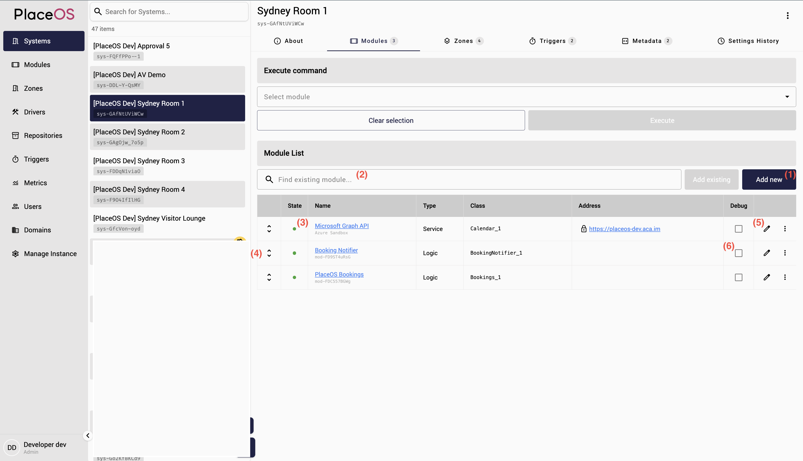

# PlaceOS Backoffice

PlaceOS Backoffice is the primary admin interface used to configure, manage and support PlaceOS deployments. It is accessible  at `/backoffice/` on your server. E.g.

```http
https://<My-PlaceOS-Instance>/backoffice/
```

All actions performed by backoffice at also available via the [PlaceOS REST API](reference/api), which may be used to automate the configuration/management actions offered by Backoffice.

**Prerequisite Reading:** [PlaceOS Key Concepts](overview/key-concepts/)

# Domains

Each PlaceOS deployment can handle multiple web domains where it can be accessed, and each domain may host multiple PlaceOS apps (typically web apps). Each User in PlaceOS exists in one domain only, and if single-sign-on (SSO) authentication is configured then the PlaceOS user will be automatically generated when the user SSOs for the first time.

If there are multiple Domains configured on the same PlaceOS instance and a person signs into more then one of them with the same email address or unique identifier, then that person will appear as a different PlaceOS user object, once on each domain.

## Authentication
Each domain can be configured with an authentication provider such as Microsoft or Google. For instructions, see [how-to/authentication]

## Applications
Each domain can host multiple apps, and each app must be added here with an OAuth Redirect URL

// ### Adding an Application

## Users
This tab will list the Users that exist on this Domain.

## Settings
### Config
JSON added to the config tab of the domain will be advertised publicly for apps to discover configuration relevant to this domain. This includes things like the unique ID of the PlaceOS Organization Zone which is the root/parent of all the PlaceOS Zones and Systems that are relevant to this Domain

// ### Setting the Organization Zone ID
// ### Setting the default web app for the domain

### Internals
JSON added to the internals tab of the domain will be available to apps only after the user has successfully authenticated. This include things like system configurations


# Repositories
PlaceOS uses cloud hosted Git repositories for management of both Drivers and Frontend Web apps. This Repositories tab is where PlaceOS admins can add new public or private Drivers or User Interface repository URLs (e.g. a Github url), select the branch and commit to use, and define which web path user interfaces will be accessible at under the domain.

// ### Adding a new Driver Repository
// ### Adding a new User Interface Repository

# Drivers
Once Git repositories that contain PlaceOS Drivers have been added from the Repositories tab, Drivers can be added to PlaceOS from here. Added Drivers will be available for adding to any System (i.e. they are available across all Domains).

// ## Adding a new Driver
// ## Updating or rolling back a Driver
// ## Changing Driver Settings
// ## Deleting a Driver

# Zones
The Zones Section presents a searchable list of all defined Zones. Selecting a Zone will list that Zone’s Description, Settings, Metadata and Systems. New Zones can be added by clicking the + icon.

## Tags
PlaceOS apps are able to retrive Zones with specific tags, so tags such as "org", "region", "building", "level", are often used to determine the heirarchical structure of a physical environment in which the app is to provide functionality for. 


## Settings
Zone JSON Settings are inherited by all Systems in that Zone, and any Logic Modules in those Systems will also inherit the Settings. This makes Zone settings the ideal location to configure any logic modules.

// ### Editing Zone Settings

## Metadata
Metadata JSON is not inherited by Systems or Child Zones and is often where frontend apps will look to determine their configuration (enabling/disabling certain features and behaviours).


# Systems

Systems are a collection of Modules, and often represent a physical room/space. The Systems section (1), displays a list of all systems currently defined. This list can be filtered by using the search box (2).

Once a System is selected from the list, it’s details will be displayed in the main section. The heading lists the system’s name and System ID (3). Below this are six tabs:
- About
- Modules
- Zones
- Triggers
- Metadata
- Settings History

## About Tab
This section will list the system’s Support URL, which should usually be set to the URL of the main Interface for controlling the system, Description and Settings. 
The system description can be entered in Markdown format, and is a useful reference for other administrators of the System.

## Modules Tab
The modules tab allows the creation of new modules (1) or the addition of existing modules to the current system (2). See [Adding Drivers and Modules](tutorials/backoffice/adding-drivers-and-modules.md)




The module list shows each module’s current online status (3) and provides handles for drag and drop reordering (4). The settings and properties of each module can be viewed by clicking on its name and edited by clicking on the edit icon (5).
The Debug checkbox (6) on the right of the Address enables live debugging output for this module to the a text console. Press F12 or Ctrl+Shift+I to use the browser's development javascript console instead, which offers more layout, filtering and searching options.

Clicking a module's status dot (3) and selecting the View State option in the menu that appears will output the module’s current status information to the console to assist in troubleshooting scenarios.


## Zones Tab
This section lists the Zones that this system is a member of and allows Joining (1) and Leaving (4). See the Zones section under Key Concepts for more information on the effects of Zones on Systems. Zones are listed in order of hierarchy (highest (2) to lowest (3)) and can be re-ordered by dragging the handles on the left (5). Click the Zone name to edit the settings and properties for that Zone or to see the other systems that are part of that Zone.

## Triggers Tab
This tab will list the Triggers that have been added to this system. Click on the Trigger name to view or edit the Triggers actions and properties.

## Configuring Room Booking
When PlaceOS is integrated with a Directory service (e.g. Exchange Online, via MS Graph API), certain System settings will affect whether the PlaceOS Staff API will treat the system as a Bookable Room and with what kind of behavior. If your account has System Admin access, then the edit button (a pencil icon, at the top right of the system's page) will be available. Clicking this icon will show the above popup where the following details can be edited:

- Name: The name of the system (room) that will be shown in PlaceOS apps like the room booking panel and staff app.
- Email: The mailbox that represents the room's calendar. This email address' default calendar will be queried to check which bookings exist for this room. The email address will be invited to any room bookings that a user creates from a PlaceOS app (e.g. Staff App). The mailbox should be configured in the directory service (typically Exchange online) as a Resource Mailbox.
- Support URL: This optional link is useful for admins to click to immediately open a web app associated with the room (e.g. booking panel or meeting room control panel) in a new browser window.
- Number of Touch Panels: This number value should be set to the total number of fixed, physical touch panels that exist for this room. This includes room booking panels and meeting room (AV) control panels. The number is used to calculate the number of expected incoming web connections from fixed hardware to apps relating to this system. When there are less panels connected than are expected, when a warning will show on the Backoffice Metrics page.
- Capacity: This number indicates the number of seats that the room has. This will affect whether this room will be displayed in app search results that specify a minimum capacity.
- Bookable Room: This checkbox toggles whether the room should be listed in room available search results in PlaceOS apps like the Staff App and Concierge. Only systems with this box checked will show up in search results and thus be available for users to book via PlaceOS apps.
- Features: A space separated list of IDs for room features can be listed here. PlaceOS apps may use this setting to know that the system has that feature
Example: "extra_features": "vc skype mics window dinner coffee"


# Modules

The Modules section (1) will list all modules that have been added to PlaceOS. This list can be filtered (2) by Name, IP Address or online status (3).

Clicking on a Module in the list will bring up that module’s details in the main section for viewing and editing.
New modules can be added by clicking the Add icon (4).

## Adding and Editing Modules
1. To Edit an existing module, click the pencil icon, to add a new module, click the '+' icon (4). This will display a popup window where the new Module details can be entered. Select the desired Dependency (1) (for more information on modules and dependencies, see Key Concepts) and System (2) to add the module to. Both drop down lists are text searchable.
2. If applicable, enter the IP address (3) and TCP/UDP Port (4) of the hardware module being added. In most scenarios, the port value can be left blank (it will default to that dependency’s configured default).
Note: For modules being controlled by RS-232, the IP address should be set to the IP address of the RS-232 gateway module (e.g. Globalcache) that will be connected to the module’s serial port. In these scenarios, the Port value should be changed to the correct value for the IP to RS-232 gateway module (e.g. 4999 for Globalcache iTach units).
3. The next section of checkboxes defines the nature of the connection to the module. This will usually be dependent on the requirements of the module itself (see the control protocol documentation for the module).
If the TCP connection to the module is to be encrypted, check the TLS checkbox (5) (e.g. PlaceOS PC Control Module).
If the connection is to be made via UDP instead of TCP, check the UDP checkbox (6).
If the TCP session to the module should always be terminated instead of kept open, enable Make-Break (7)
If the module is expected to be offline regularly (e.g. a portable module) and it’s status should not be tracked on the PlaceOS Metrics Dashboard, check Ignore connected (8)

4. The URI field (9) is only for modules that are controlled by HTTP requests (instead of direct TCP commands). See Driver Types under Key Concepts for more information. If the Driver is type ‘Module’ then this field should be blank and the IP (3) should be entered. If the Driver is type ‘Service’ then the IP field should be blank, and the control URI of the module should be entered (this should be documented in the module’s control protocol manual).
The Notes section (10) is for any text-based metadata (for reference purposes). Notes are inherited from Dependencies in the same way as Settings. Markdown format is supported:

5. Additional settings can be defined in the Settings section (11). See Key Concepts for more information on the function of Settings. Modules will always inherit settings defined in the Driver that they are an instance of. Settings must be in valid JSON format or else the field will be highlighted red and the ‘Create’ button will be disabled.
6. The Custom Name field (12) is for defining a name that can be used to refer to this module in the System’s settings. For example, if there are multiple video switchers in the system, one can be referred to as ‘Table Front’ and another as ‘Table Rear’ and these names can be used to differentiate between them in the System’s settings.


## Deleting Modules
Modules can be deleted by clicking the Bin icon. Deleting a module will immediately remove it from any Systems that it has been added to. To remove a module from a System without deleting it, visit that System’s module tab instead and click ‘Remove’


# Users
PlaceOS usually integrates with an external directory system (such as Azure Entra ID) for authentication.
The Users Section lists all users who have signed in, their level of access and a History (log) of the Systems which were accessed (controlled from an Interface or viewed in Backoffice).
## Permissions
When first logging on, a user will have no permissions assigned and will be denied access to Backoffice. A System Administrator should then look up the User from the list in the User’s Section of Backoffice and set their permissions:
- Tech Support: Have access to view Backoffice and all objects but cannot create or edit Systems and Modules.
- System Admin: Full write access to all objects
