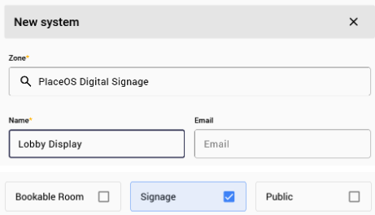
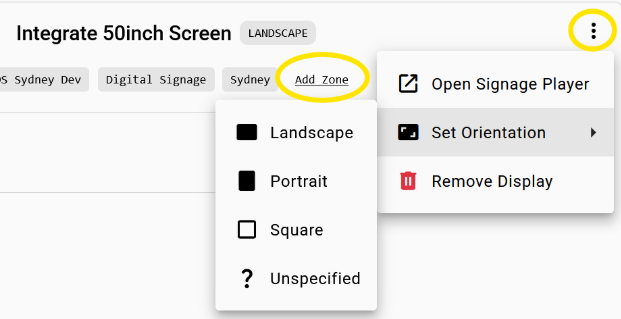
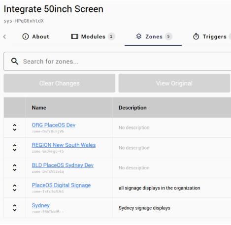

Each signage display in the organisation should be individually targeted.

A display is represented by a System in PlaceOS.

This means you should create a System for each Display in Backoffice.

Make sure to select the Signage checkbox when configuring.

These systems can be used to manage the displays:
- power off and on times by adding the device and configuring triggers.
- display volume (either on device or via a DSP)

The system can also manage other devices such as:
- edge AI cameras
- motion sensors
- people counters etc.

If the display is purely virtual, i.e. no hardware to control, just a playback machine to be configured with a playback URL, then you can add displays directly from the Displays tab.

## Orientation

Configuring display orientation and zones can also be done from the Displays tab.

## Zones

Ensure the system representing a display is added to relevant zones.
Zones are useful for routing content to particular areas - making it simpler to present information to an organization, building, level or department.

See [PlaceOS Zones](/tutorials/backoffice/add-zone-structure.md) for more information on configuring Zones in PlaceOS.

