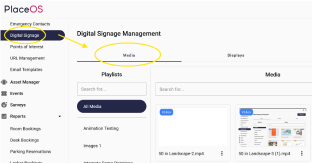
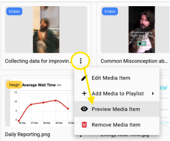

Select the media tab in the concierge UI.

You can now drag and drop images and videos for presentation.

## Supported Formats
The following media formats are supported.

### Image Formats
- APNG (Animated Portable Network Graphics)
- AVIF (AV1 Image File Format)
- GIF (Graphics Interchange Format)
- JPEG
- PNG
- WebP

### Video Formats
- MP4
  - Video
    - AVC (H.264)
    - AV1
    - VP9
  - Audio
    - AAC
    - FLAC
    - MPEG-1 Audio Layer III (MP3)
    - Opus
- WebM
  - Video
    - AV1
    - VP9
    - VP8
  - Audio
    - Opus
    - Vorbis

## Preview Content

You can preview uploaded content in the media library.

