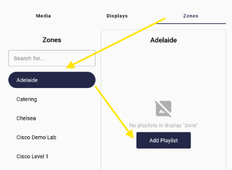
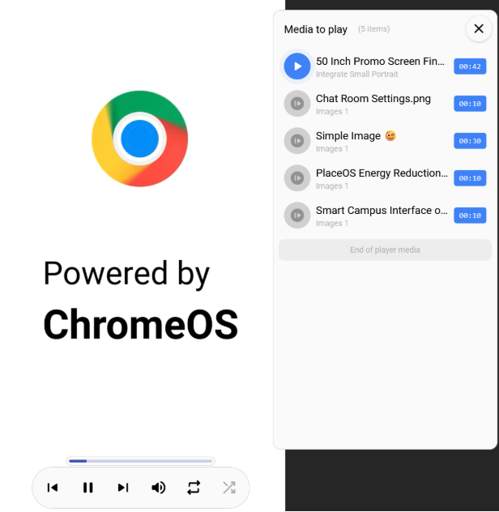

There are two methods for doing this
1. Assigning playlists to zones
2. Assigning playlists directly to a display

Generally assigning playlists to zones is ideal as a single zone can target multiple displays.
Only assign directly to displays if the content explicitly targets that display, i.e. a cafe menu

## Assign Playlist

1. Select the zones or displays tab
2. Select a zone or display from the sidebar
3. Add a playlist

## Preview Playback

You can preview the content being pushed to a display by:
1. Selecting a display
2. Clicking “Open Signage Player”

This will open a preview window with player controls for listing and skipping content. These controls will not be visible on the physical displays.

To show the media list click the note icon.

This lists the media currently scheduled to the display and allows you to skip to any part of the playlist.
