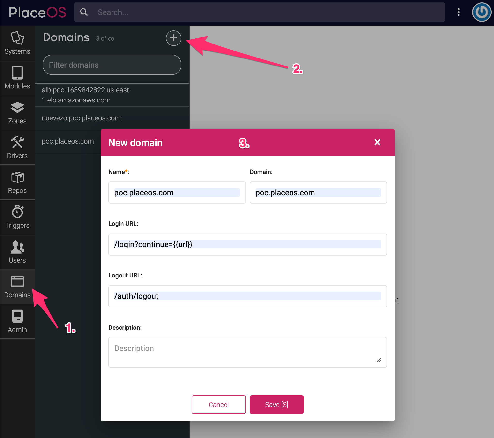
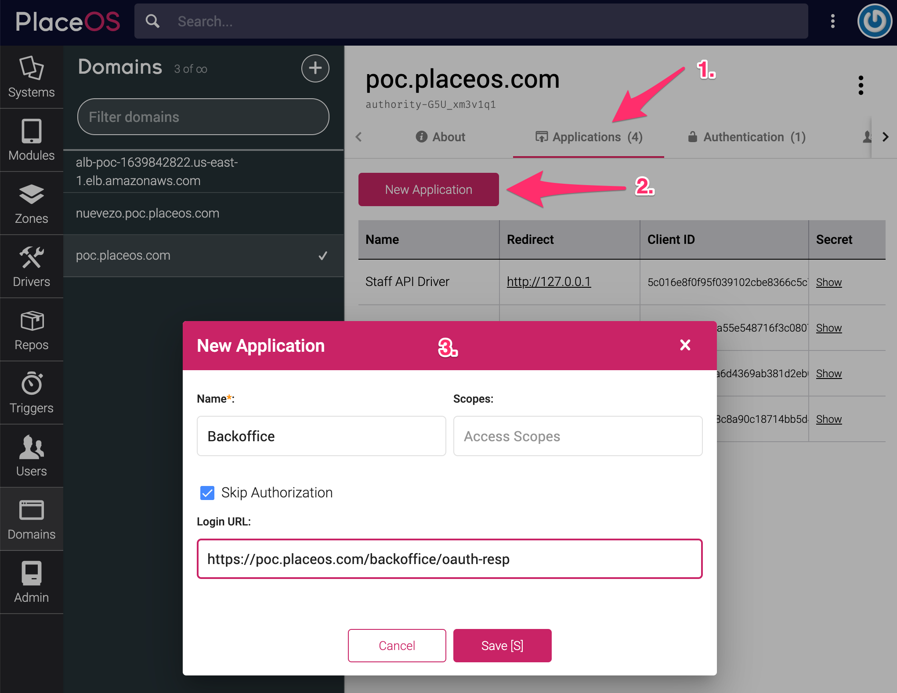
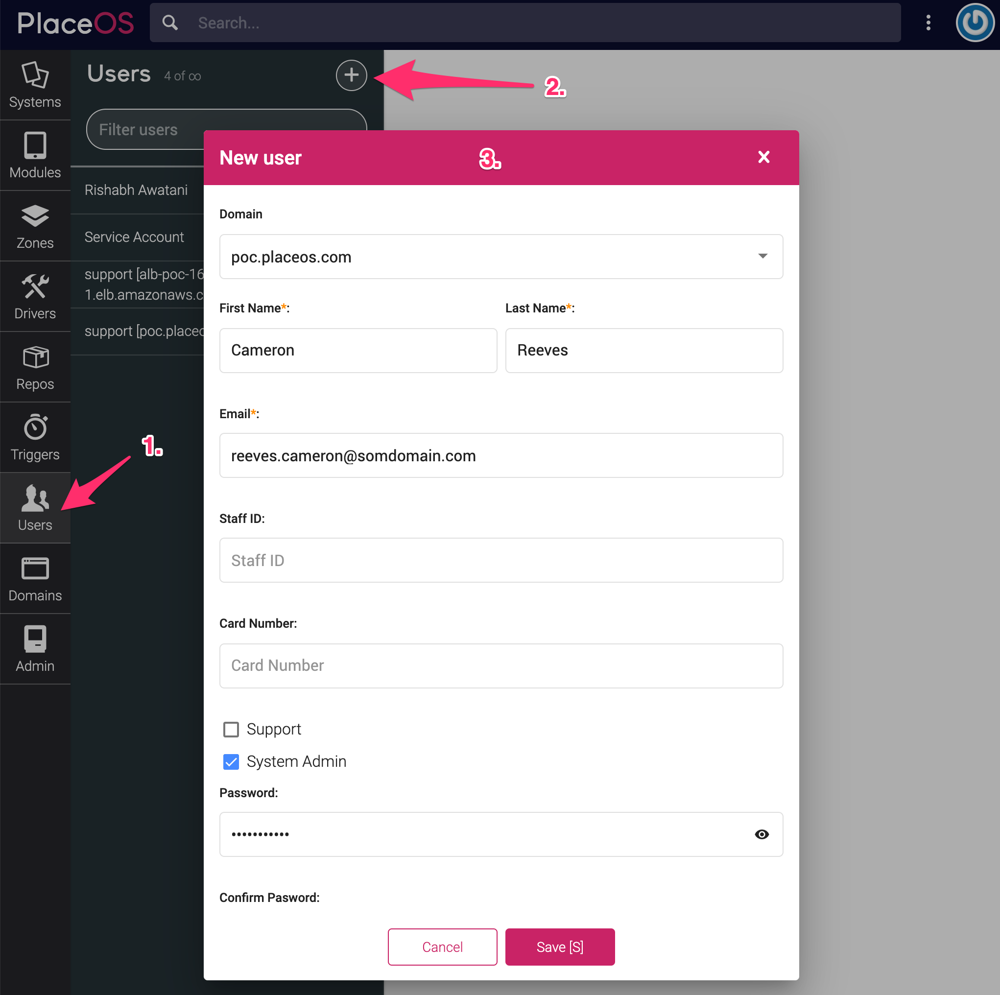

## Overview

This guide will step through the process of creating a domain and the associated application(s) that will exist on it. 

You must create a domain before adding authentication sources (such as [SAML](../how-to/authentication/configure-saml.md)) to it.

## Prerequisites
1. PlaceOS has been deployed
2. You know the domain(s) required for the deployment and the applications on them

## Step 1: Create the New Domain

1. Log in to Backoffice on the domain created during deployment and select the Domains tab
2. Select the `+` button to bring up the New Domain form
3. Add the following fields:
   - `Name`: Can be anything to identify the domain, like the domain itself i.e. `placeos.domain.com`
   - `Domain`: The actual domain, without a protocol i.e. `placeos.domain.com`
   - `Login URL`: The URL redirected to when a user logs in
      - You should usually set this to `/login?continue={{url}}`
   - `Logout URL`: The URL redirected to when a user logs out
      - You should usually set this to `/auth/logout`

## Step 2: Add an Application to the Domain

1. Select the Applications tab
2. Choose New Application
3. Add the following fields:
   - `Name`: Can be anything to identify the applications
      - Usually the folder path where the application resides but capitalized i.e. `Backoffice`
   - `Scopes`: Leave this blank
   - `Skip Authorizaiton`: Check the box to set this to `true`
   - `Login URL`: The location that users are redirected to after completing authentication
      - This will generally be something like `https://<domain>/<application path>/oauth-resp.html`

## Step 3: Add a User to the Domain

1. Select the Users tab
2. Select the New User button
3. Add or select the following fields:
   - `Domain`: Select the domain you created in Step 1
   - `First Name`: Add the first name of the user, this is required
   - `Last Name`: Add the last name of the user, this is required
   - `Email`: This will be the username and is required
   - `System Admin`: Denotes whether the user will be an admin (and thus can access and make changes in Backoffice)
      - This will usually be set to true when creating users in this interface
   - `Password` and `Confirm Password`: Enter the password which the user will use to login (when not using SSO)

You can now login with this new user on the domain created.
