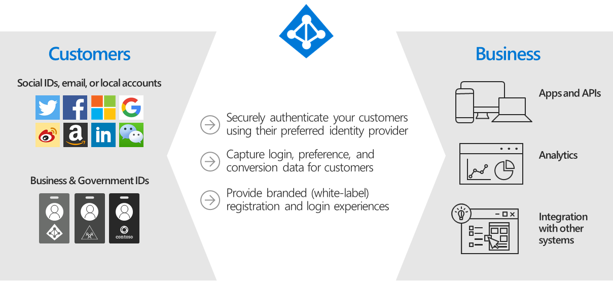

# Azure B2C

[Azure B2C (Business to Consumer)](https://docs.microsoft.com/en-us/azure/active-directory-b2c/overview) is an authentication service provided by Microsoft designed to enable any users to register and authenticate against a web application.

Azure B2C may be used with PlaceOS where the organisation wish to provide external access to users not part of their organisation, this is commonly used for shared working or co-working spaces.&#x20;

Under this configuration, Azure B2C is configured and added to PlaceOS as a OAuth2 Provider.&#x20;

To use Azure B2C, you will require:

* An active Azure Tenant
* An Azure Subscription with valid payment method
* Administrator Access to an Azure B2C Tenant and/or sufficient access to create and deploy the Azure B2C Tenant from your existing tenant.&#x20;

These instructions will assume you are able to configure an Azure B2C Tenant under your existing tenant and will only cover the specific requirements for PlaceOS Configuration.&#x20;

There are two steps to this process:

1. Create Azure B2C Custom Policy Framework in your Azure B2C Tenant
2. Configure PlaceOS Authentication Source & Azure App Registration
