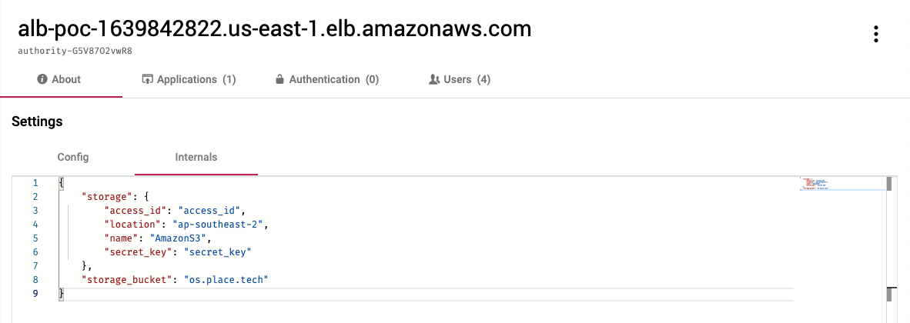
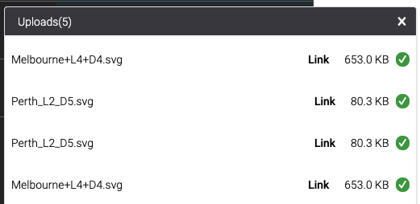
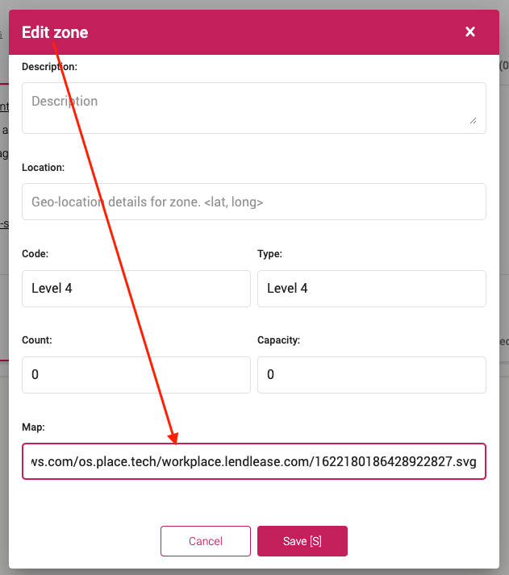

## Overview

Backoffice supports uploading files to cloud storage for public read access.  
This is useful for device documentation, SVG Floor Maps or Room Photos.

## Prerequisites

1. Configure your storage bucket on the cloud storage platform
2. Ensure CORS is enabled for the domain Backoffice will be uploading from
3. Note the storage bucket name
4. Generate access credentials for the storage bucket

## Backoffice configuration

1. Go to the domains tab and select the domain in Backoffice you use to access Backoffice
2. From the `About` tab, select the `Internals` sub-tab
3. Enter the bucket name and access keys, examples below:



### S3 Example

```json
{
  "storage_bucket": "os.place.tech",
  "storage": {
    "name": "AmazonS3",
    "access_id": "your-access-id",
    "secret_key": "your-secret-key",
    "location": "ap-southeast-2"
  }
}
```

### Google Cloud Storage

```json
{
  "storage_bucket": "os.place.tech",
  "storage": {
    "name": "GoogleCloudStorage",
    "access_id": "your-access-id",
    "secret_key": "your-private-key-in-PEM-format",
    "api": 2
  }
}
```

### Microsoft Azure

```json
{
  "storage_bucket": "os.place.tech",
  "storage": {
    "name": "MicrosoftAzure",
    "account_name": "your-access-id",
    "access_key": "your-access-key"
  }
}
```

### Rackspace

```json
{
  "storage_bucket": "os.place.tech",
  "storage": {
    "name": "OpenStackSwift",
    "username": "racks-key",
    "secret_key": "racks-secret",
    "storage_url": "something like MossoCloudFS_abf330f5-5f4e-48be-9993-b5dxxxxxx",
    "temp_url_key": "racks-temp-url-key"
  }
}
```

### OpenStack Swift

```json
{
  "storage_bucket": "os.place.tech",
  "storage": {
    "name": "OpenStackSwift",
    "username": "admin:admin",
    "secret_key": "racks-secret",
    "storage_url": "AUTH_admin",
    "auth_url": "https://swift.domain.com/auth/v1.0",
    "location": "https://swift.domain.com",
    "temp_url_key": "temp_url_key",
    "scheme": "https"
  }
}
```


## Cloud configuration

### S3 Configuration

You will find this under bucket permissions -> CORS configuration.

```xml
<?xml version="1.0" encoding="UTF-8"?>
<CORSConfiguration xmlns="http://s3.amazonaws.com/doc/2006-03-01/">
<CORSRule>
    <AllowedOrigin>*</AllowedOrigin>
    <AllowedMethod>GET</AllowedMethod>
    <MaxAgeSeconds>3000</MaxAgeSeconds>
    <AllowedHeader>Authorization</AllowedHeader>
</CORSRule>
<CORSRule>
    <AllowedOrigin>https://os.place.tech</AllowedOrigin>
    <AllowedMethod>PUT</AllowedMethod>
    <AllowedMethod>POST</AllowedMethod>
    <AllowedMethod>DELETE</AllowedMethod>
    <AllowedHeader>*</AllowedHeader>
</CORSRule>
</CORSConfiguration>
```

You will want to configure the access key with minimal permissions too:

1. In IAM, create a new user to act as the service account
2. Grant the user no permissions except S3 List, Read, Write, Object permissions management 
3. Generate some access keys to use for signing upload requests

An example IAM user policy for file uploads:

```json
{
    "Version": "2012-10-17",
    "Statement": [
        {
            "Sid": "VisualEditor0",
            "Effect": "Allow",
            "Action": "s3:ListBucket",
            "Resource": "arn:aws:s3:::os.place.tech"
        },
        {
            "Sid": "VisualEditor1",
            "Effect": "Allow",
            "Action": "s3:*Object",
            "Resource": "arn:aws:s3:::os.place.tech/*"
        },
        {
            "Sid": "VisualEditor2",
            "Effect": "Allow",
            "Action": [
                "s3:PutObjectVersionAcl",
                "s3:PutObjectAcl"
            ],
            "Resource": "*"
        }
    ]
}
```

If you don't want the user to have object permission management then you also override the bucket level policy, where all objects are public

```json
{
    "Version": "2008-10-17",
    "Id": "Policy1397632521960",
    "Statement": [
        {
            "Sid": "Stmt1397633323327",
            "Effect": "Allow",
            "Principal": {
                "AWS": "*"
            },
            "Action": "s3:GetObject",
            "Resource": "arn:aws:s3:::os.place.tech/*"
        }
    ]
}
```
## Upload Files

Once the above configuration steps are completed, you should be able to upload files to PlaceOS.

To upload a file, drag and drop it into Backoffice in your browser.

The file upload status will be displayed.



Once the upload is complete, you can copy the file URL and use this as required.



:::tip
The uploaded file will be given a discrete URL on the storage bucket, for example: `https://s3-ap-southeast-2.amazonaws.com/bucket.name/directory.name/16221818379492128.svg`.  
Characters will be automatically encoded, if present.
:::


*[CORS]: Cross-Origin Resource Sharing
*[IAM]: Identity & Access Management
