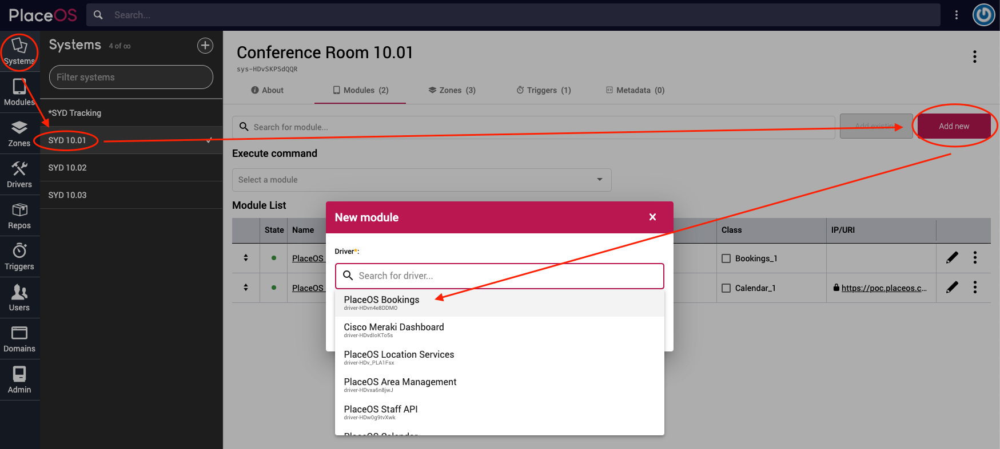

# Bookings Driver

The primary purpose of the Bookings Driver is to enable room booking panels, kiosks and space maps.

Best practice is to add the Bookings Driver to every system on PlaceOS that supports room booking.

## Prerequisites

* Administrator access to your PlaceOS Backoffice
* PlaceOS Drivers Repository Configured in Backoffice
* Systems have a valid calendar resource address from Microsoft 365 or Google Workspace

## Add Driver

Before we can use the PlaceOS Bookings Driver we must instantiate it as a driver.

1. Navigate to the Drivers tab
2. Click the `+` icon to add a new driver
3. Select `PlaceOS Drivers` Repository
4. Select the `drivers > place > bookings.cr` Driver Base
5. Select the latest commit
6. Click Save\
   

## Add to Systems

You need to instantiate a single instance of the PlaceOS Bookings Driver in each system that has a bookable space.

1. Navigate to a bookable system
2. Select the `Modules` tab
3. Click `Add New`
4.  Select `PlaceOS Bookings`

    &#x20;
5.  Click Save

    &#x20;
6. Click the Black Dot next to the Module to start it

## Test Module

You can test by creating a booking and inspecting the state of the Bookings Driver.

Inspecting the state will return a JSON response of all bookings for that systems calendar resource.

In the example below, you will see a positive response with a calendar booking.


## Status Variables

<table><thead><tr><th width="228.9585596192685">Status</th><th width="150">Values</th><th>Function</th></tr></thead><tbody><tr><td><code>booked</code></td><td>(Bool)</td><td><code>true</code> when there is a current (start time &#x3C; current time &#x3C; end time)</td></tr><tr><td><code>next_pending</code></td><td>(Bool)</td><td><code>true</code> from <code>pending_before</code> mins before an event start time until the event start time OR until <code>checkin</code> / <code>start_meeting</code> is executed.</td></tr><tr><td><code>current_pending</code></td><td>(Bool)</td><td><code>true</code> from the event start time until <code>pending_period</code> mins after the event start time OR until <code>checkin</code> / <code>start_meeting</code> is executed.</td></tr><tr><td><code>pending</code></td><td>(Bool)</td><td><code>true</code> when either <code>current_pending</code> or <code>next_pending</code> is true</td></tr><tr><td><code>in_use</code></td><td>(Bool)</td><td><code>true</code> when <code>booked</code> AND NOT <code>pending</code> (means that the current event has been checked in via <code>checkin</code> OR <code>start_meeting</code> functions)</td></tr><tr><td><code>status</code></td><td><code>free</code>, <code>pending</code>, <code>busy</code></td><td>Describes the current status of the room</td></tr></tbody></table>

## Settings

List of settings can be found in the driver source: [https://github.com/PlaceOS/drivers/blob/master/drivers/place/bookings.cr#L12](https://github.com/PlaceOS/drivers/blob/master/drivers/place/bookings.cr#L12)


<table><thead><tr><th width="253.02704884847054">Setting</th><th width="150">Default Value</th><th width="347.8541535556074"></th></tr></thead><tbody><tr><td><code>pending_before</code></td><td><code>5</code> (mins)</td><td>Number of minutes BEFORE the Booking start time until the <code>status</code> changes from <code>free</code>  to <code>pending</code> </td></tr><tr><td><code>pending_period</code></td><td><code>5</code> (mins)</td><td>Number of minutes AFTER the Booking start time until <code>status</code> changes from <code>pending</code> to <code>free</code> </td></tr><tr><td><code>disable_end_meeting</code></td><td><code>false</code></td><td>Exposes a <code>disable_end_meeting</code> status variable such that frontends like PlaceOS template Bookings can detect it and enable/disable it's auto event cancellation functionality (frontend will exec <code>end_meeting</code> causing the current event to be truncated to the current time, freeing up the room (in case of no shows).</td></tr></tbody></table>

### Example config

```
pending_before: 5,
pending_period: 0,
disable_end_meeting: false,
```

This will make `status` change to `pending` 5 mins before the booking start time. Then change to `busy` at the booking start time.

