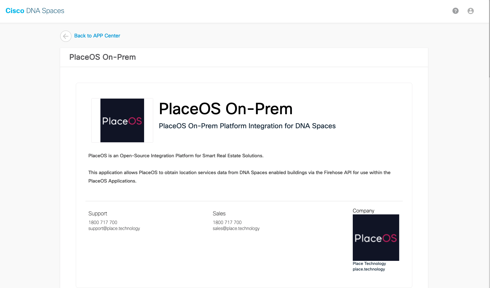
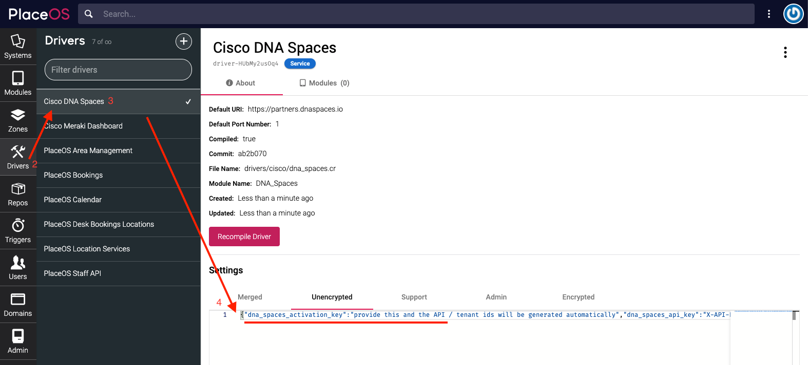
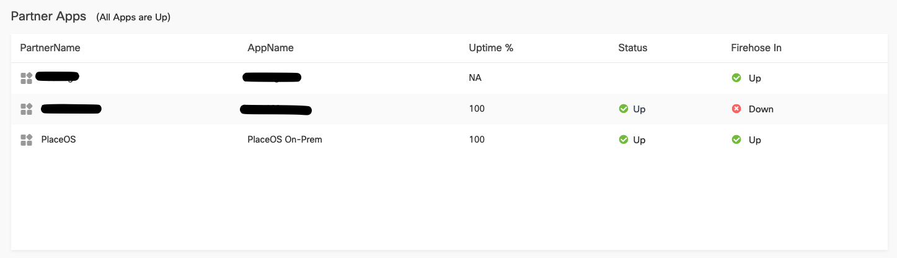
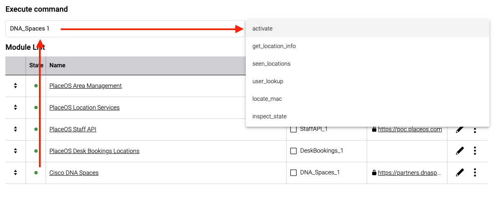

## Prerequisites

Add the Cisco DNA Spaces driver from our [standard repository](https://github.com/PlaceOS/drivers).

## Configure Cisco DNA Spaces

1. Install the PlaceOS app via your [Cisco DNA Spaces Portal](https://dnaspaces.io/partner/app/details/app-A575390EA4DD4915B863D6CA4F283F38)
   
2. On PlaceOS Backoffice Navigate to the Drivers tab
3. Select the Cisco DNA Spaces Driver
4. In the driver settings, Add your Activation key from DNA Spaces Portal as `dna_spaces_activation_key: 'your-key-here'`
   
5. Start the driver and it will complete the DNA Spaces configuration

If the Cisco DNA Spaces Driver is configured correctly:
* You will see a positive connection status on the Cisco DNA Spaces Portal
* The Cisco DNA Spaces Driver in PlaceOS will be green
* The Cisco DNA Spaces Driver in PlaceOS will not have any errors when inspecting state



If PlaceOS and Cisco DNA Spaces Portal are not connected or configured correctly:
1. Troubleshoot by adding the Cisco DNA Spaces Driver to a System
2. Enable the Driver
3. Under Execute Command, Select Cisco DNA Spaces
4. Under Select Function, Execute `Activate`
5. Inspect the response, if this fails it will report the failure reason.




## Configuring location services

1. Add `PlaceOS Staff API` driver
   * Configure a service account for this to query the API with
2. Add `PlaceOS Location Services`
   * https://github.com/PlaceOS/docs/blob/location-services/faq/location-services.md
3. Add `PlaceOS Area Management`
   * https://github.com/PlaceOS/docs/blob/area-management/faq/area-management.md


### Mapping Cisco DNA Spaces Maps to PlaceOS Zones

To configure a map ID to a zone

1. In Backoffice execute `DNA_Spaces.seen_locations`

This will return a list of space IDs against space names that DNA spaces has sent so far

```json
{
    "location-7864e7": "IXCDubai",
    "location-b9a0bf": "Cisco MEA Centers ",
    "location-9e6c2a": "MEA IXC",
    "location-cd46cf": "Cisco IXC",
    "location-3e0256": "Riyadh CBC",
    "location-be78b7": "Cisco System - Riyadh"
}
```

2. Configure the following settings in the Cisco DNA Spaces driver:

```yaml

floorplan_mappings:
  location-b9a0bf:

    # Level name here is just for your documentation
    # the driver will use the zone name config
    level_name: Cisco MEA Centers
    building: zone-GAsXV0nc4eS
    level: zone-GAsmleHgRaO

    # ideally the maps uploaded by the client have no padding, if they do
    # then this information may need to be manually defined - ideally the maps
    # in DNA Spaces and PlaceOS are the same maps
    offset_x: 70
    offset_y: 25
    map_width: 230
    map_height: 130


  location-be78b7:
    level_name: Cisco System - Riyadh
    building: zone-GAsXV0nc4eS
    level: zone-GAsdb~1fk5m

```