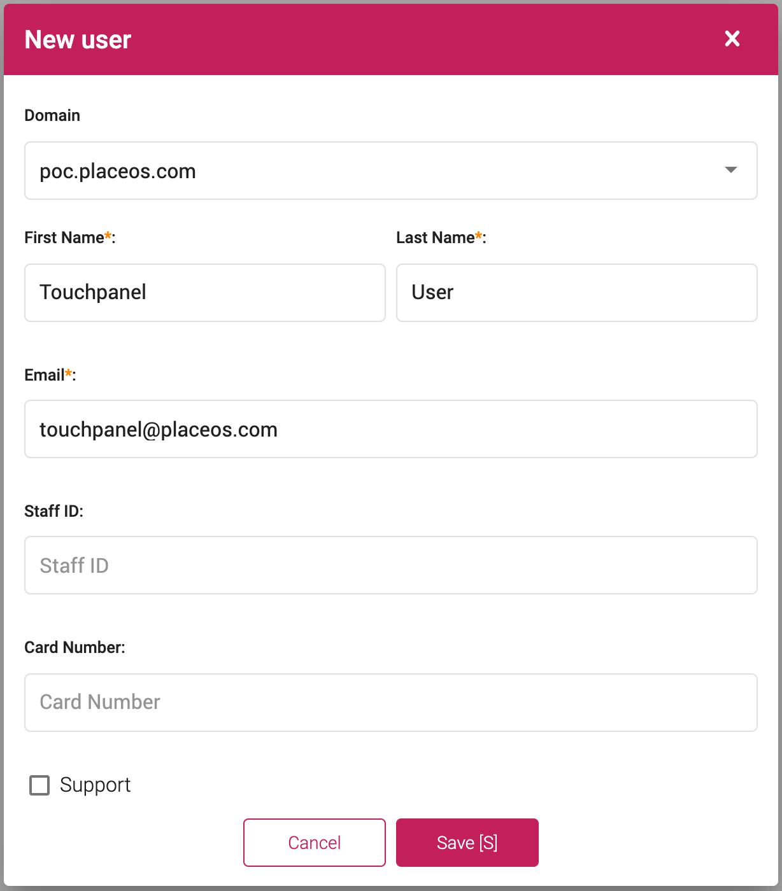

PlaceOS requires all interactions to be authenticated and associated with a specific identity.
This includes fixed devices such as visitor sign-in kiosks or public information displays.
Endpoint auto-login can provide persistent sessions for this style of shared device.

:::tip  
When PlaceOS uses an external Identity Provider with unattended device login, it should use a standard SSO flow.
Auto-login provides an option for devices or environments which may not support this.
:::

## Prerequisites
1. Confirm the final UAT and PROD URLs of the web apps
2. Ensure that the **DNS** entries for these URLs are active and forwarding to the server(s)
3. Ensure that the SSL certificates for the above domains are signed and recognized as secure

## Step 1: Create a local user account

1. Login as an admin to Backoffice
2. On the **Users** click **Add new**
3. Enter the required information, including a descriptive username (e.g. `Touchpanel User`)
4. Enter an email address (this does not need to be an active address)
5. Enter a strong password

## Step 2: Encode Username and Password

In this step, you will encode the touch panel users email address and password into a base64 string.
Use a base64 encoding service such as [base64 Encoder](https://www.base64encode.net/).

1. Encode the users email and password in the following format: `u=touchpanel@placeos.com&p=123456`
2. Once encoded, the above example will be: `dT10b3VjaHBhbmVsQHBsYWNlb3MuY29tJnA9MTIzNDU2`

## Step 3: Construct URL for Applications

To allow the endpoint auto login to work, construct the URL using the encoded credentials.

1. The first part of the URL will be your PlaceOS domain followed by `login/unattended.html?`,
   for example: `https://PLACEOS.DOMAIN/login/unattended.html?`
2. Now add the encoded credentials: `https://PLACEOS.DOMAIN/login/unattended.html?u=dT10b3VjaHBhbmVsQHBsYWNlb3MuY29tJnA9MTIzNDU2`
3. Finally, add the path to the desired application, for an AV control application this would be: `https://PLACEOS.DOMAIN/login/unattended.html?u=dT10b3VjaHBhbmVsQHBsYWNlb3MuY29tJnA9MTIzNDU2&continue=/control/`

### Escaping Characters

If there are more query parameters in the URL after `#` then they will need to be [URL encoded](https://www.urlencoder.org/).

This is common where you need to enable the interface to go directly a specific zone or system for kiosk interfaces. 

`?`, `=`, `&` and `#` are the main characters that need encoding.

For example the following URL will need to escape the `#`:

`https://placeos.domain/login/unattended.html?u=dT1zaWduYWdlQHN5ZG5leS5lZHUuYXUmcD1wbGFjZW9zMTIzdXN5ZCM=&continue=/kiosk/#/SYSTEM_ID_GOES_HERE`

This will become:

`https://placeos.domain/login/unattended.html?u=dT1zaWduYWdlQHN5ZG5leS5lZHUuYXUmcD1wbGFjZW9zMTIzdXN5ZCM=&continue=/kiosk/%23/SYSTEM_ID_GOES_HERE`

Following login, this will redirect to:

`https://placeos.domain/kiosk/#/SYSTEM_ID_GOES_HERE`
