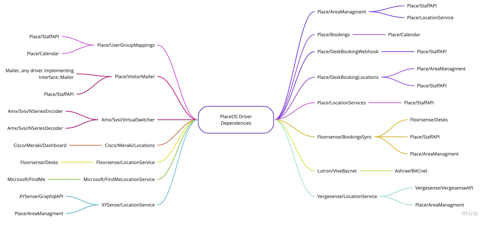

<!-- # Drivers -->

_Drivers_ are the core components of the PlaceOS platform. 
They combine to help different parts of the digital ecosystem interact with each other.
PlaceOS has drivers that fall into one of two categories:

## Integration Drivers
- **Communicate** with external systems and lets them talk to PlaceOS
- Represent hardware or software platforms (i.e. device or service)
- Control any functionality of the external systems and handle any incoming data

## Logic Drivers
- **Coordinate** interactions between modules
- Don't map to specific physical objects
- Represent abstract or conceptual functions 
- May use a variety of devices or software platforms

<!-- images pending asset folder or mermaid.js -->
<!--  -->

## Drivers and Modules
[Modules](modules.md) are instances of drivers, letting the rest of PlaceOS access their specific functions.

## Driver Map

The driver map shows driver dependencies in PlaceOS.

<!-- TODO: Change to MermaidJS Diagram when Supported -->