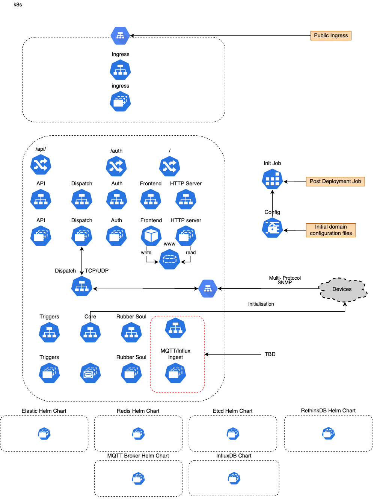

# System Architecture

### Service Architecture

High level network diagram of an implementation orchestrated via Kubernetes on Azure

### Microservices running in PlaceOS Kubernetes Cluster 

PlaceOS service integrators and support partners manage these microservices. They work in different combinations to best suit the needs of each site.

#### `ingress`

Serves web requests (static files and upstream reverse proxying to the API service).\
See the [Docker Image](https://hub.docker.com/r/yobasystems/alpine-nginx) and [Source on GitHub](https://github.com/nginx/nginx).

#### `etcd`

Distributed key-value store used for PlaceOS service discovery and leader election.\
See the [Docker Image](https://hub.docker.com/r/bitnami/etcd) and [Source on GitHub](https://github.com/etcd-io/etcd).

#### `postgresql`

Database for permanent storage of PlaceOS configuration. Configuration: Three node cluster in 3 different availability zones within same region for [HA](system-architecture.md#HADC).\
See the [Docker Image](https://hub.docker.com/\_/rethinkdb) and [Source on GitHub](https://github.com/rethinkdb/rethinkdb).

#### `core`

Application in a Docker container that interfaces with external devices/services.\
See the [Docker Image](https://hub.docker.com/r/placeos/core) and [Source on GitHub](https://github.com/PlaceOS/core).

#### `auth`

Application in a Docker container that provides authentication.\
See the [Docker Image](https://hub.docker.com/r/placeos/auth) and [Source on GitHub](https://github.com/PlaceOS/auth).

#### `rest-api`

Application in a Docker container that provides REST API for web applications.\
See the [Docker Image](https://hub.docker.com/r/placeos/rest-api) and [Source on GitHub](https://github.com/PlaceOS/rest-api).

#### `triggers`

Perform user defined actions, without code, under certain conditions.\
See the [Docker Image](https://hub.docker.com/r/placeos/triggers) and [Source on GitHub](https://github.com/PlaceOS/triggers).

#### `dispatch`

Reverse proxy incoming communications from devices/services to PlaceOS core. This is required to handle protocols like SNMP - often not required.\
See the [Docker Image](https://hub.docker.com/r/placeos/dispatch) and [Source on GitHub](https://github.com/PlaceOS/dispatch).

### High Availability and Distributed Control 

High availability works by distributing services through Availability Zones. For platforms like AWS Fargate, containers are initially automatically distributed. If a zone becomes unavailable, containers are re-launched in an alternative Availability Zone.

#### Components

[**Drivers**](overview/drivers.md) exist as files inside the PlaceOS core containers. PlaceOS Core creates a separate process for each Driver in use. This will serve all the Modules (instances) of this Driver.

[**Modules**](overview/modules.md) are instances of a Driver, that represent a single real-world device/service. They are distributed among the instances of core and exist in memory of the PlaceOS core containers. Modules reflect their runtime state in Redis, making it available for other components of the system

The PlaceOS Backoffice web application manages them both via PlaceOS REST-API. It updates module configuration via PostgresQL.

#### Service Discovery

Instances of PlaceOS Core advertise their existence to an etcd cluster as they come online. They also query etcd to discover other active instances. Each service continues to advertise it’s existence with the short TTL while it's are online. If a service is offline, etcd will automatically remove it’s entry after the TTL expires. Interested services are made aware of any changes to the cluster so they can rebalance.

#### Distribution of Modules across Cores 

Rendezvous hashing determines the module distribution across active instances of PlaceOS Cores. It also alters the distribution when a core goes online or offline. All Cores will push runtime Module state to Redis where other components can access it. That state can persist the availability of the Core.
