# Configure Staff API

The Staff API gives PlaceOS the ability to interact with Calendar and User Resources.

To integrate room booking into your existing calendar environment you must configure Staff API.

Once you have configured Staff API, PlaceOS can:

* Create
* Edit
* Update
* Delete Calendar events in Microsoft 365 or Google Workspace.

To show room status on floor maps, the [PlaceOS Calendar driver must also be configured](placeos-calendar.md).

To enable room bookings, the [PlaceOS Bookings driver must be also configured](placeos-bookings.md).

## Prerequisites

* Access on Microsoft Azure or Google Cloud Console & Workspace to create apps and API permissions
* Administrator access to your PlaceOS Backoffice

## Configure Providers

To enable Staff API you must complete the necessary configuration in your cloud provider.

Instructions for Microsoft 365 and Google Workspace are below.

## Microsoft Azure (365)

To use Staff API with 365 you will need to create an Application in App Registration.

You may have already completed this step if you have configured [PlaceOS for Microsoft 365 User Authentication.](../configure-placeos-for-microsoft-365/)

If you have already created an app, you ca skip to Grant Graph API Permissions.

If not, you will need to create a new App Registration on Azure.

### **Create Azure App**

1. Navigate to the [Azure Portal](https://portal.azure.com)
2. Log in and select the correct Subscription for your application
3. Navigate to [App Registrations](https://portal.azure.com/#blade/Microsoft\_AAD\_RegisteredApps/ApplicationsListBlade)
4. Select New Registration
5. Enter the required information
   * Name it and select the appropriate "Support Account types" (typically "Single tenant")
   *   Optionally paste the PlaceOS `Assertion URL`&#x20;

       &#x20;
6. Register the app

### Grant Graph API Permissions

You will now need to grant Graph API Permissions on your App.

1. Select the app you would like to give permissions
2.  Click API Permissions

    &#x20;
3.  Click Add Permission

    &#x20;
4.  Click Microsoft Graph

    &#x20;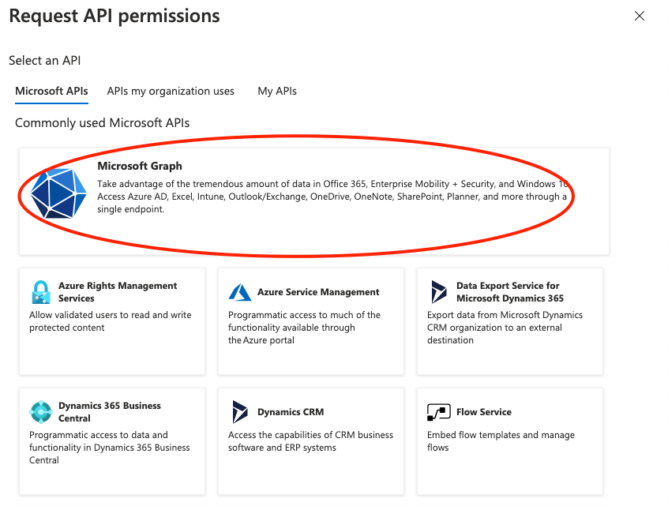
5.  Select **Delegated permissions**

    &#x20;
6.  Grant API Access to the following resources (or whichever resources are approved by the Azure administrator):

    * `openid`
    * `offline_access`
    * `Calendars.ReadWrite`
    * `Calendars.ReadWrite.Shared`
    * `Group.Read.All`
    * `User.Read`
    * `User.Read.All`
    * `Contacts.Read`
    * `Place.Read.All`&#x20;

    
7. Click Add Permissions
8. Grant Admin Consent for all the new permissions

### **Generate Azure API Secret**

You will now need to create the secret to allow PlaceOS Staff API to Authenticate.

1.  Navigate to Certificates & Secrets

    &#x20;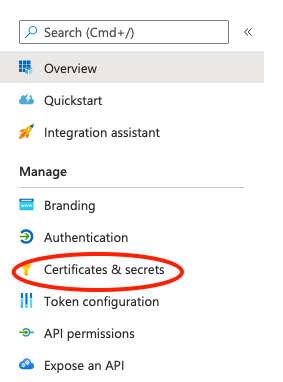
2.  Select New client secret

    &#x20;
3. Give your secret a description e.g. `PlaceOS Prod App Secret` and click Add
4. Copy and Save the Secret Value (you will need this in the next step) 
5. Return to the App Overview
6. Copy and Save the `Client ID` and `Tenant ID` (you will need these in the next step) 

## Google Workspace

To use Google APIs you will need a server to server OAuth2 application configured.

This involves creating a service account that PlaceOS will use for authentication.

The service account can “act as” staff in the organization.

The service account can perform actions on behalf of a user, such as booking meeting rooms.

For further information see [Creating and Managing Service Accounts](https://cloud.google.com/iam/docs/creating-managing-service-accounts).

**Configure Google Cloud API Project**

1. Go to [Google Cloud Console](https://console.cloud.google.com/)
2. Configure an existing API Project or Create a New API Project 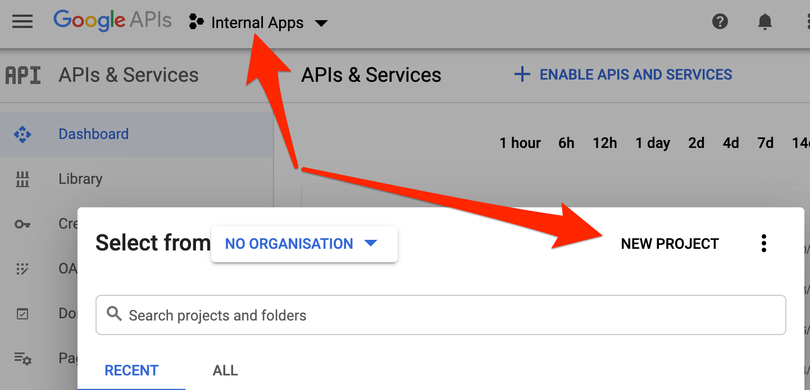 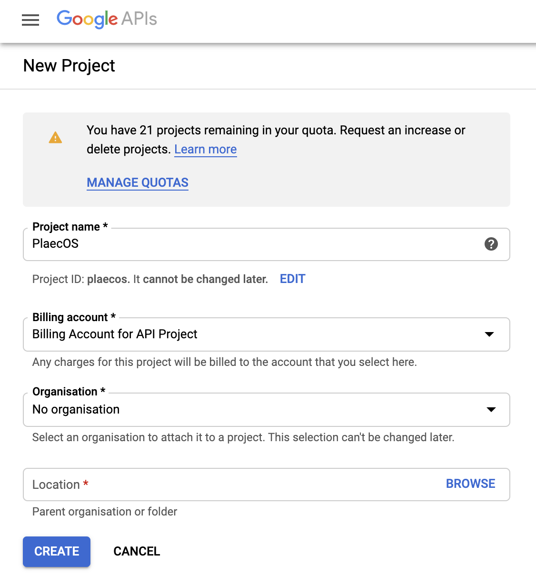
3. Open your API Project and select `APIs & Services` followed by `Dashboard` 
4. Select `Enable APIs and Services`
5. Search for and enable the following SDK:
   * Admin SDK (for staff directory)
   * Google Calendar API
   * Google Drive API (for attachments)
6. For limiting access to a subset of the organization, you may also want to enable:
   * Marketplace SDK (not Marketplace API)
   * Drive API

### **Configure the Service Account**

1.  Under APIs & Services, navigate to Credentials

    &#x20;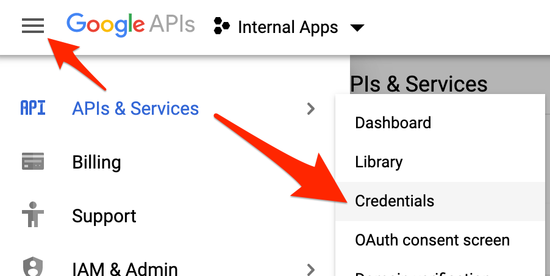
2. Click on the Create Credentials and select Service Account Key 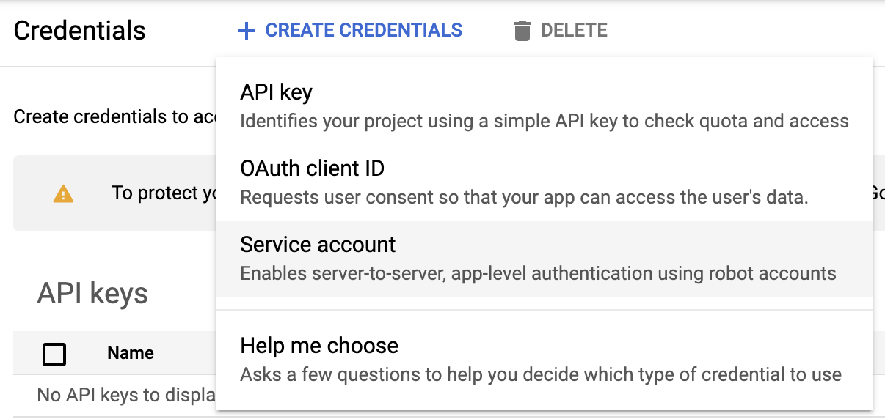
3.  Create a new Service Account

    &#x20;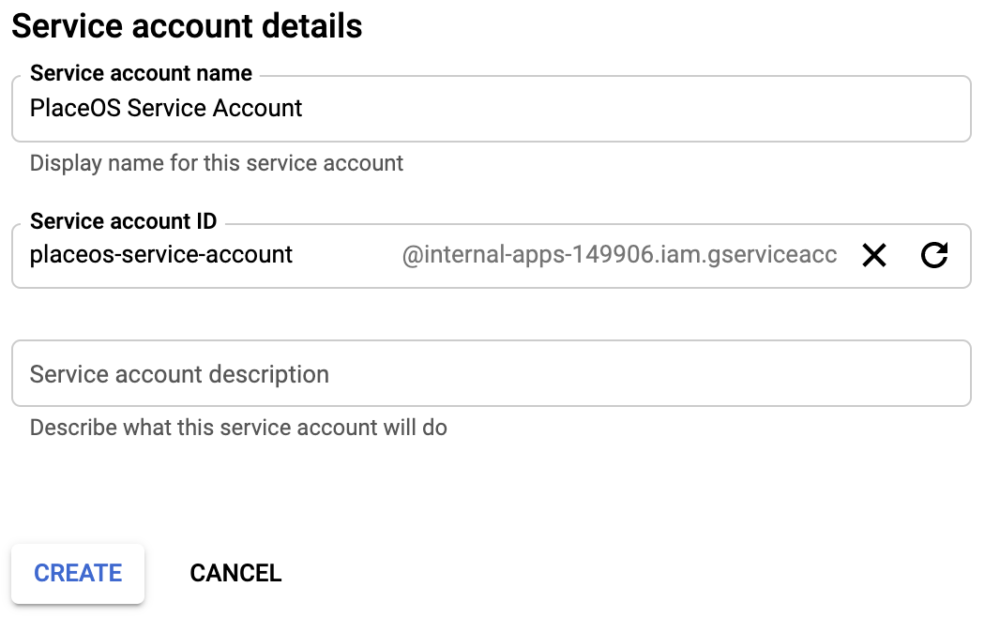
4. You can ignore the next steps in the wizard, click `Done` to return to the list of service accounts
5. Click the service account you created and select the `Keys` tab to create an access key 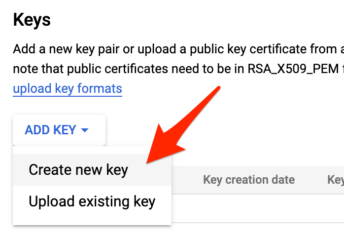
6. This will save a JSON File to your computer, you will need this information to configure the service.
7. Once the key has saved, return to the `Details` tab and enable Domain Wide Delegation 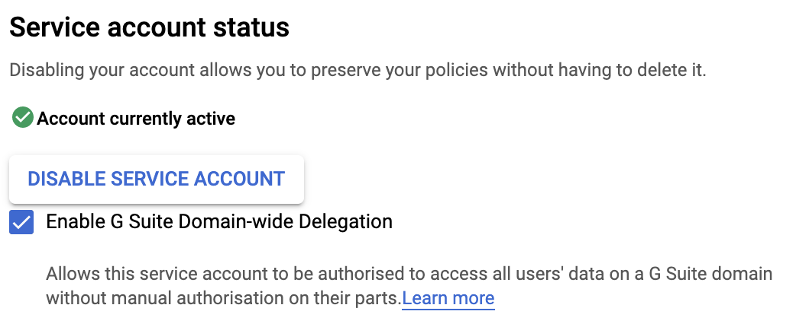
8. Click Save

### **Configure Service Account Permissions**


If you want to configure this application for use in a subset of the organization, ignore this step.

Continue with the steps to “Create a marketplace application”


1. Open the JSON File that we saved in the previous step
2.  Copy the `client_id`

    &#x20;
3. Navigate to [Google Workspace Admin](https://admin.google.com)
4. Select `Security`
5. Scroll down to `API Controls`
6. Select `Manage Domain Wide Delegation`
7. Click `Add new` and enter the `client_id` you extracted earlier
8. Add the following API Scopes:
   * `https://www.googleapis.com/auth/calendar`
   * `https://www.googleapis.com/auth/admin.directory.user.readonly`
   * `https://www.googleapis.com/auth/drive.file` 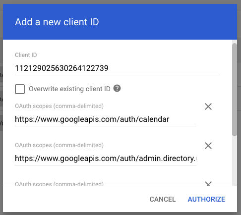
9. Click `Authorize`
10. Ensure you enable API Access by going to `Security -> API Controls`
11. Select `Trust internal, domain owned apps`

    &#x20;


The scope `https://www.googleapis.com/auth/drive.file` allows the application to add attachments to calendar events, such as QR codes.

It does not allow for reading or modifying any files not created by the application.


### **Creating a Marketplace Application**


This step applies to organizations where a specific region or department (OU) will be using the application.

This step is not applicable to most organizations.


1. On [Google Cloud Console](http://console.cloud.google.com/) navigate to the API Services Dashboard
2. Select the G Suite or Google Workspace Marketplace SDK 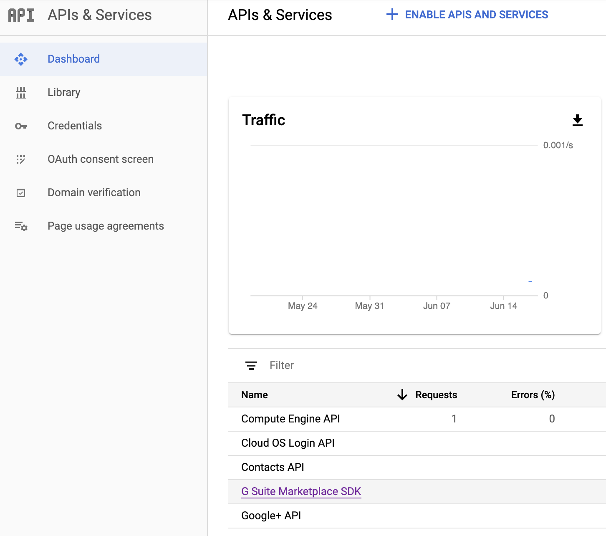
3.  Select the `Configuration` tab

    &#x20;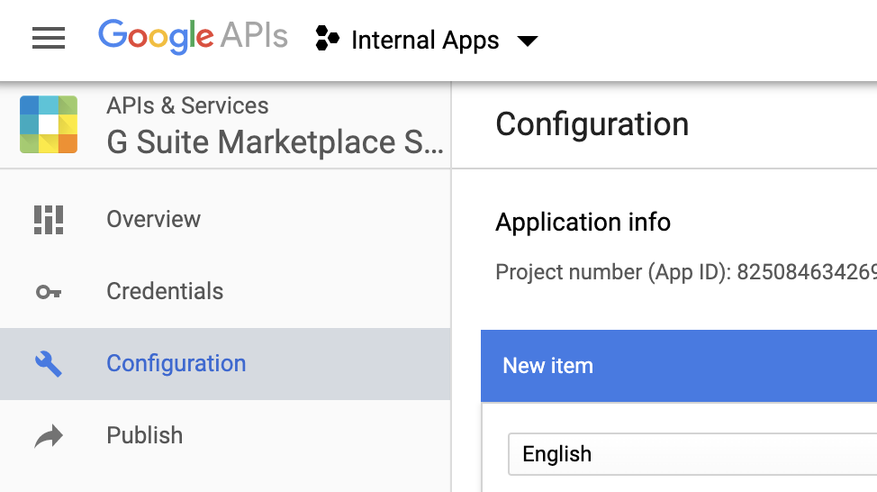
4. Fill in the app name and description, un-check `Enable individual install` 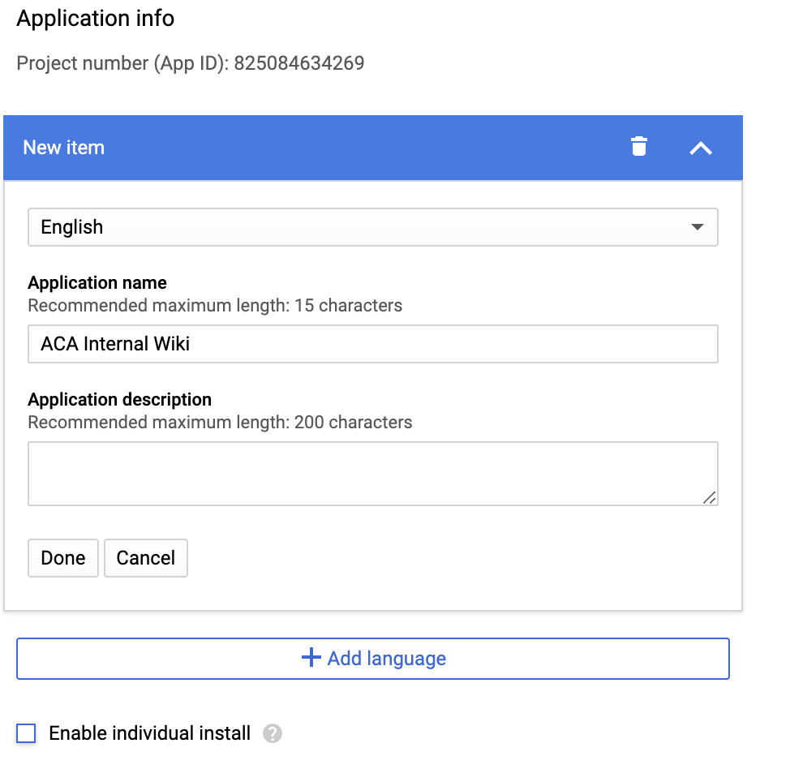
5. Upload icons as required
6. A Terms of Service URL is also required, you can set this to your companies homepage
7. Enter the following scope URL:
   * `https://www.googleapis.com/auth/calendar`
   * `https://www.googleapis.com/auth/admin.directory.user.readonly`
   * `https://www.googleapis.com/auth/drive.file`
8. Enable drive extension and click `Configure drive SDK` 
9. Fill in the details and icons for the Drive Application
10. Once completed, return to the marketplace application form
11. Ensure you set visibility to `My Domain`

    &#x20;
12. Click `Save Changes`

Deploy the marketplace application to the organizational unit that will be using the application.

Follow the steps to [Install a Google Workspace Marketplace App in your Domain](https://support.google.com/a/answer/172482?hl=en).

## Configure Staff API on PlaceOS

You will now need to enter the information obtained from the App Registration and API Permissions.

To complete this step, you will need the following information:

* Microsoft Azure (all information obtained from Azure App Register)
  * `Client ID`
  * `Tenant ID`
  * `Secret`
* Google Workspace
  * `Domain` - this is the domain your users use when logging into Google
  * `Service Account Email` - service account user created in previous steps
  * `Scopes` - what Google services are we accessing (calendar, admin groups, etc)
  * `Private Key` - available via the JSON downloaded from Google Cloud Console
  * `Service User` - a Google Workspace user with required permissions to read resource calendars/user information
  * `User Agent` - user defined and helps with looking at Google logs to see application actions

1. Open PlaceOS Backoffice and login as an administrator
2. Navigate to the Admin Tab
3. Select Staff API
4.  Select the Domain you want to configure

    &#x20;
5. Click Add Tenant
6. Enter the information required\

7. If you are configuring access for Microsoft 365 ensure you tick 'Delegated Access' and enter `teamsForBusiness` in the Conference Type field.\
   <!-- TODO: Add screenshot -  -->
8. Save

### Test Staff API Configuration

The easiest way to test the Staff API Configuration is using the [PlaceOS Calendar Driver](placeos-calendar.md) or [Microsoft API Calendar Driver for 365 Delegation](../configure-placeos-for-microsoft-365/calendar-access/configure-placeos-calendar-driver.md).&#x20;

The `staff-api` logs will show any errors in configuration.

We can view these logs by connecting to the server and running `docker logs --tail 99 -f staff-api`.

An example log with an authentication error to Microsoft 365:

```
level=[E] time=2021-06-24T04:10:58Z program=StaffAPI source=action-controller client_ip=218.214.254.247 request_id=50173a7d-a819-4413-8f8a-94adf592f309 domain=poc.placeos.com tenant_id=71 event=error method=GET path=/api/staff/v1/calendars/free_busy?period_start=1624507858&period_end=1624543199&zone_ids=zone-HDvnRd_9lAS status=500 duration=345.62ms
error fetching token UNAUTHORIZED (401)
{
    "error": "invalid_client",
    "error_description": "AADSTS7000215: Invalid client secret is provided.\r\nTrace ID: 6f090c0f-079f-4930-a123-b1242a4f3f00\r\nCorrelation ID: 0424faa6-2325-4c79-b0e3-726d68db7655\r\nTimestamp: 2021-06-24 04:10:58Z",
    "error_codes": [
        7000215
    ],
    "timestamp": "2021-06-24 04:10:58Z",
    "trace_id": "6f090c0f-079f-4930-a123-b1242a4f3f00",
    "correlation_id": "0424faa6-2325-4c79-b0e3-726d68db7655",
    "error_uri": "https://login.microsoftonline.com/error?code=7000215"
}
```
