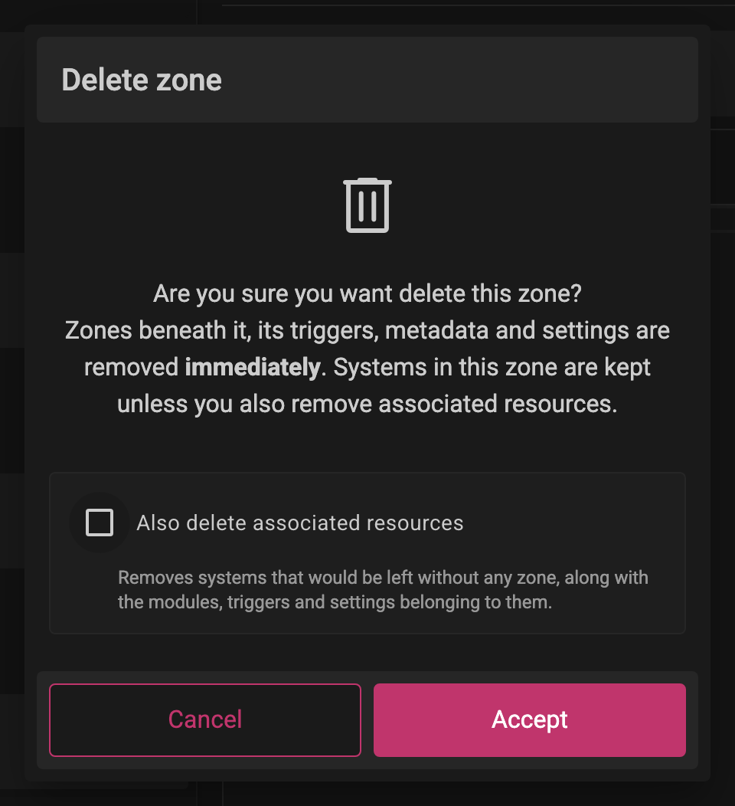
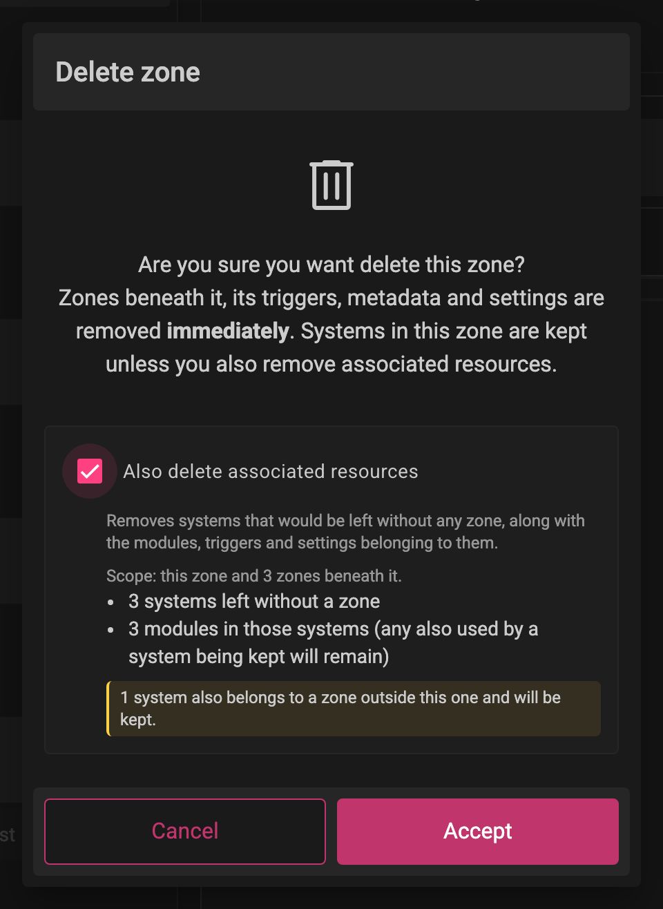
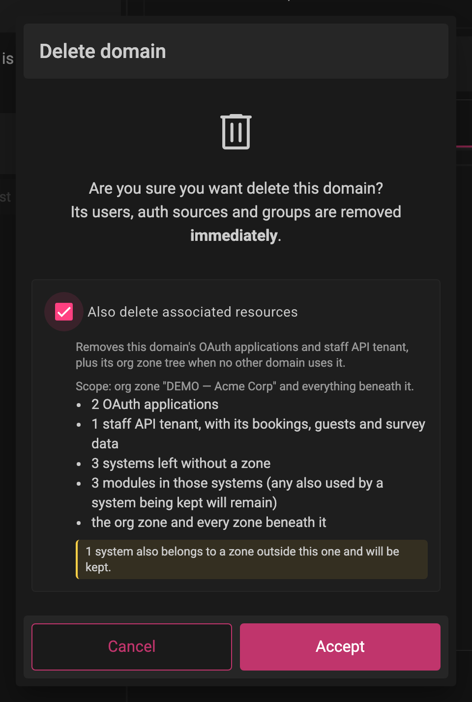
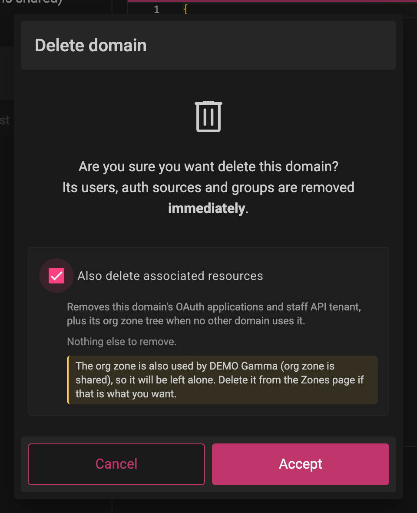
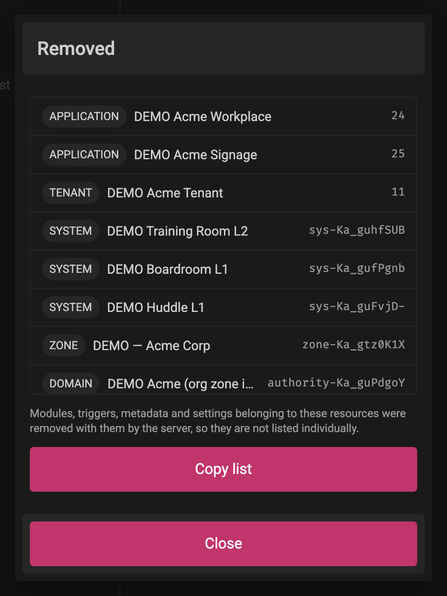

# Delete Zones and Domains

Zones and Domains are deleted from their page in Backoffice: select the item, open the three-dot menu and choose `Delete Zone` or `Delete Domain`. The confirmation dialog offers an optional cascade, `Also delete associated resources`. When ticked, the dialog shows what else will be removed before you confirm, and lists everything that was removed afterwards.

The option is off by default. Leaving it unticked deletes exactly what Backoffice always deleted.

## Prerequisites

* PlaceOS Backoffice Administrator Access

## Delete a Zone

1. Login to PlaceOS Backoffice
2. Navigate to Zones and select the zone
3. Open the three-dot menu and select `Delete Zone`

Deleting a zone removes the zones beneath it and its triggers, metadata and settings. Systems in the zone are kept, unless you also delete associated resources.

### Zone Associated Resources

Ticking `Also delete associated resources` removes the systems that the delete would leave without any zone, along with the modules, triggers and settings belonging to them. A system that also belongs to a zone outside the one being deleted is kept, and the dialog tells you how many are kept for this reason.

A summary of what will be removed is shown:

Modules belonging to a removed system are removed with it, unless another system still uses them.

## Delete a Domain

1. Login to PlaceOS Backoffice
2. Navigate to Domains and select the domain
3. Open the three-dot menu and select `Delete Domain`

Deleting a domain removes its users, auth sources and groups. With `Also delete associated resources` ticked, the delete also removes:

* The domain's OAuth applications
* The domain's Staff API tenant, with its bookings and guest records (every tenant matching the domain, if there is more than one)
* The domain's org zone tree: the zone named by `org_zone` in the domain's config and every zone beneath it, along with the systems that would be left without a zone (the same rules as a zone delete)

The org zone tree is only removed when no other domain uses it. If another domain's `org_zone` points into the same tree, the zones are left alone and the dialog names the domain sharing them:

If the domain has no `org_zone` configured, no zones can be matched to it and the dialog says so. Delete its zones from the Zones page instead. If the configured org zone no longer exists, the dialog says that too and removes no zones.

## Removal List

After the cascade has run, the dialog lists everything that was removed, in the order it was removed, with the type, name and id of each resource. Click an id to copy it, or `Copy list` to copy the whole list as tab-separated values for pasting into a spreadsheet.

Modules, triggers, metadata and settings belonging to the removed resources are removed with them by the server, so they are not listed individually.

## Failed Removals

The cascade stops at the first failure. Later steps are not attempted, and the Zone or Domain itself is left in place. The list is headed "Partly removed". Resources that could not be removed and resources that were not attempted are shown in their own sections, and `Copy list` marks those rows as FAILED and SKIPPED.

Resolve the failure and run the delete again. The plan is worked out fresh each time, so anything already removed no longer appears in it.
