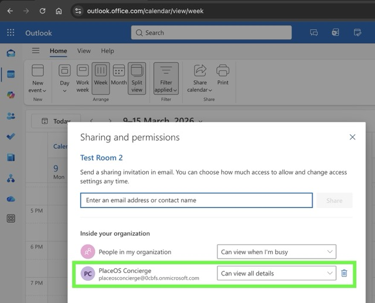

# Allowing Concierge App Users to view/manage Room Calendar schedules

The PlaceOS Concierge App includes a bird's eye view of Meeting Room Calendars. The level of event detail that users of the Concierge app will see within the Concierge app depends on their user's permissions on each room's calendar within Exchange Online, and will match what the user sees when viewing the room calendar in Outlook. This permission is managed by your organizations Exchange Online or Azure Administrator.

PlaceOS recommends:
1. Adding all Concierge App users to one or more Entra Security Groups, to simplify the management of their permissions on room calendars. For , let's add all the users who will use the Concierge app to an Entra security group called "PlaceOS Concierge Users". 
    * If your organization has multiple buildings then you may want to create a separate Group for each building, where each Group has permissions to view the full details of that building's meeting room calendars.
2. Setting each Room Calendar's permissions to allow the above mentioned Group(s) to VIEW full event details and Accept/Decline events on behalf of the room. The Exchange configuration for this will be explained below.

Your organization's Exchange Online or Azure administrator will be able to determine the desired level of meeting room calendar permissions for your concierge app users, and then perform the steps below to set those permissions enabling concierge app users greater visibility over room calendar event details (e.g. see Title and Organizer) than a typical Outlook user (who may only see anonymous free/busy slots).

## 1. Creating a "PlaceOS Concierge Users" Entra Security Group

1. An Azure admin should navigate to the [Microsoft 365 Admin Centre: https://admin.microsoft.com/](https://admin.microsoft.com/)
2. In 365 Admin Centre select the Teams & Groups Blade -> Active teams & groups.
   <!-- TODO: Add screenshot -  -->
3. In Active teams & Groups select Add Group.
   <!-- TODO: Add screenshot -  -->
4. For Group Type select Mail-enabled Security.
   <!-- TODO: Add screenshot -  -->
5. Give your group a relevant name such as "PlaceOS Concierge Users"
   <!-- TODO: Add screenshot -  -->
6. Nominate a user (typically a tenant administrator) as the group owner
   <!-- TODO: Add screenshot -  -->
7. In add members, select your Concierge users for that office location
   <!-- TODO: Add screenshot -  -->
8. Nominate an address for the group.
   <!-- TODO: Add screenshot -  -->
9. Click Finish, followed by Create Group.

## 2. Allowing the Group to View or Edit meeting room Event details

1. An Outlook user who is an administrator of the Room Mailbox/Calendar (e.g. an Exchange Online Admin) should navigate to the Calendar view of Outlook (or Outlook Online)
2. Add the Room calendar to your list of calendars by selecting Add Calendar > Add from Directory and searching for the target Room.
3. Once the Room Calendar is added and appears in the list of calendars on the left sidebar, right click the room calendar and click "Sharing and Permissions". If this option is not listed in the right-click menu, then your Outlook user is not an administrator of the room, so cannot change its permissions.

Now choose either Option A or B below:

#### Option A: Giving the group permissions to VIEW meeting room Events

Choosing this option will allow Concierge app users to view the Host and Title of events in the meeting room calendar. They will not be able to change the rooms existing Accept/Decline response.

4. A) In the "Sharing and permissions" window, search for the Concierge Group and click "Share", then set permission level of that Group to __"Can view all details"__

 Alternatively to using Outlook, your Exchange Online admin could user Powershell to apply the Concierge group's permissions to a list of rooms: [https://learn.microsoft.com/en-us/powershell/module/exchangepowershell/set-mailboxfolderpermission?view=exchange-ps](https://learn.microsoft.com/en-us/powershell/module/exchangepowershell/set-mailboxfolderpermission?view=exchange-ps)

#### Option B: Giving the group permissions to Accept/Decline and EDIT meeting room Events
Choosing this option will allow Concierge app users to change the Accept/Decline response of the room for events.

4. B) In the "Sharing and permissions" window, search for the Concierge Group and click "Share", then set permission level of that Group to __"Can edit"__

 Alternatively to using Outlook, your Exchange Online admin could user Powershell to apply the Concierge group's permissions to a list of rooms: [https://learn.microsoft.com/en-us/powershell/module/exchangepowershell/set-mailboxfolderpermission?view=exchange-ps](https://learn.microsoft.com/en-us/powershell/module/exchangepowershell/set-mailboxfolderpermission?view=exchange-ps)

