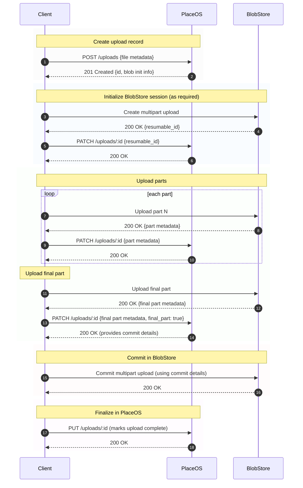

## Uploads

PlaceOS can be configured to upload a cloud blob storage service. Content may include:

* Images for spaces
* PDFs and other documents for API protocols etc
* Digital signage content

The API provides clients with signed requests for performing the upload to the blob store directly.

### Multi-part / resumable uploads

File larger than 5MB are uploaded in 5MB chunks and then commited to the blob store.
This is the flow for `"type": "chunked_upload"` if in the response payload of the initial `POST /api/engine/v2/uploads` request.

