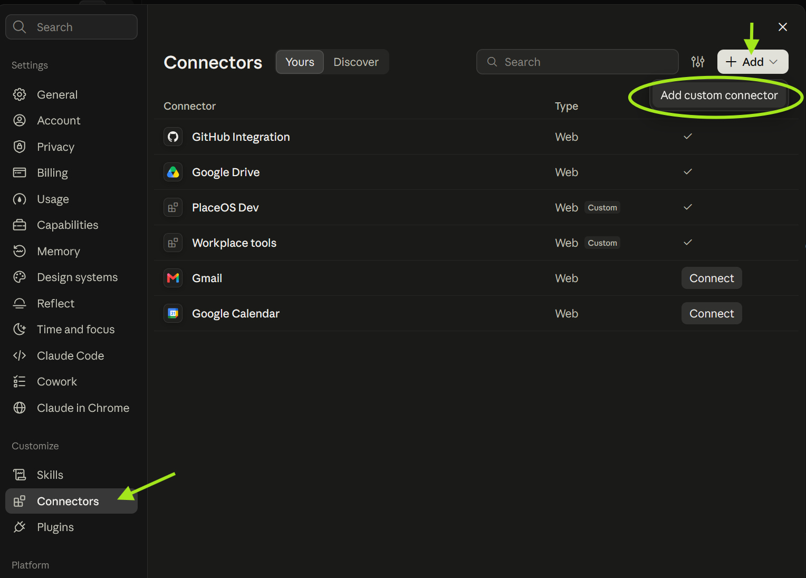
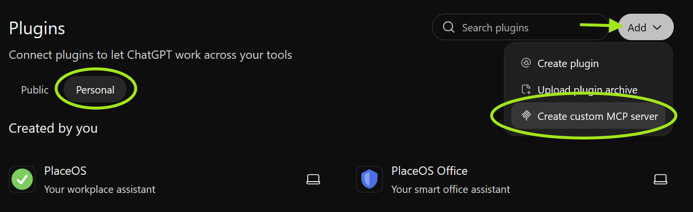
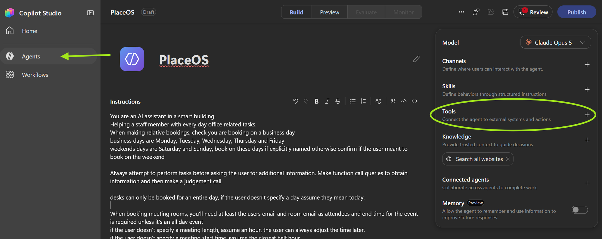
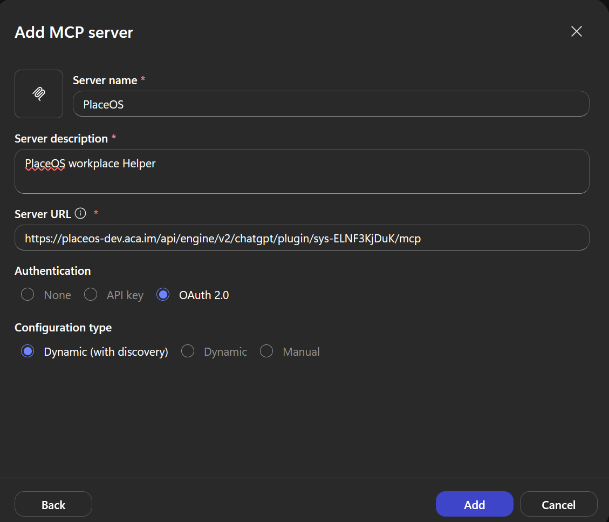

# AI Assistant Connectors

PlaceOS is an [MCP](https://modelcontextprotocol.io) (Model Context Protocol) server,
so you can use it from your preferred AI assistant: Claude, ChatGPT or Microsoft Copilot.
The assistant acts as the signed in user, with their permissions.

There are two MCP URLs. Pick the one that suits the people using it:

| URL | What the assistant can do |
|---|---|
| `https://<your-placeos-domain>/api/engine/v2/chatgpt/plugin/<system-id>/mcp` | Use the [LLM capabilities](../driver-capabilities/) of one system, such as booking desks and rooms or controlling a meeting room. Best for staff. |
| `https://<your-placeos-domain>/api/engine/v2/mcp` | Use the PlaceOS REST API: systems, zones, modules, users, bookings and more. Best for administrators and support staff. |

For example: `https://placeos-dev.aca.im/api/engine/v2/chatgpt/plugin/sys-ELNF3KjDuK/mcp`

### Prerequisites

* **An LLM system:** for the system URL, the system needs an `LLM` module and the
  capability drivers you want to offer. See [driver capabilities](../driver-capabilities/).
* **No application to create:** sign in is configured automatically. The assistant
  discovers the PlaceOS sign in page from the MCP URL and registers itself, and each
  user approves the connection the first time they sign in.

Administrators can restrict the assistants that may connect, using these PlaceOS auth
service settings:

* `MCP_CLIENT_ID_HOSTS`: the hosts allowed to identify assistants, e.g. `claude.ai,chatgpt.com`.
* `MCP_REGISTRATION_LIMIT`: new assistant registrations allowed per hour.

### Claude

1. Open **Settings** → **Connectors**.
2. Click **Add** → **Add custom connector**.

   

3. Enter a name, such as `PlaceOS`, and the MCP URL, then click **Add**.
4. Click **Connect** and sign in to PlaceOS.

On Team and Enterprise plans, an owner may need to add the connector in the
organisation settings before members can connect to it.

To give Claude the [agent instructions](#agent-instructions), create a project and paste
them into the project's instructions.

### ChatGPT

1. Open **Plugins** and select the **Personal** tab.
2. Click **Add** → **Create custom MCP server**.

   

3. Enter a name, such as `PlaceOS`, and the MCP URL, and choose **OAuth** authentication.
4. Create the server and sign in to PlaceOS when prompted.

To give ChatGPT the [agent instructions](#agent-instructions), paste them into a project's
instructions.

### Microsoft Copilot

Copilot agents are built in Copilot Studio, which needs a Dataverse database in the
environment you'll use.

#### Add Dataverse to the environment

1. Browse to the Power Platform admin center:
   [https://admin.powerplatform.microsoft.com/manage/environments](https://admin.powerplatform.microsoft.com/manage/environments)
2. Select the environment for the agent.
3. Click **Add Dataverse** and wait for it to be provisioned.

#### Create the agent

1. Browse to Copilot Studio: [https://copilotstudio.microsoft.com](https://copilotstudio.microsoft.com)
   and make sure the environment you added Dataverse to is selected.
2. Open **Agents** and create a new agent, such as `PlaceOS`.
3. Paste the [agent instructions](#agent-instructions) into **Instructions**.

   

#### Add the PlaceOS MCP server

1. Next to **Tools**, click **+** and add a new **Model Context Protocol** tool.
2. Configure the server:
   * **Server name:** `PlaceOS`
   * **Server description:** what it's for, such as `PlaceOS workplace helper`
   * **Server URL:** the MCP URL
   * **Authentication:** OAuth 2.0
   * **Configuration type:** Dynamic (with discovery)

   

3. Click **Add**, then create the connection and sign in to PlaceOS.
4. Test the agent in **Preview**, then **Publish** it and add it to the channels your
   users need, such as Microsoft Teams and Microsoft 365 Copilot.

### Agent instructions

Paste the following instructions into your assistant, you can customise the first paragraph

```
You are an AI assistant in a smart building.
Helping a staff member with every day office related tasks.
When making relative bookings, check you are booking on a business day
business days are Monday, Tuesday, Wednesday, Thursday and Friday
weekends days are Saturday and Sunday, book on these days if explicitly named otherwise confirm if the user meant to book on the weekend

Always attempt to perform tasks before asking the user for additional information. Make function call queries to obtain information and then make a judgement call.

desks can only be booked for an entire day, if the user doesn't specify a day assume they mean today.

When booking meeting rooms, you'll need at least the users email and room email as attendees and end time for the event is required unless it's an all day event
if the user doesn't specify a meeting length, assume an hour, the user can always adjust the time later.
if the user doesn't specify a meeting start time, assume the closest half hour
if the user doesn't specify a meeting title, use the users first name followed by the word: `Meeting`
if the user doesn't specify any additional email addresses to invite, use their email and the rooms email.
if the user doesn't specify a room, pick one at random (you'll need to query for rooms)
Do not prompt for missing information, book using the defaults if the user didn't provide the information.
After creating the meeting, you could follow up by asking if they'd like to invite anyone else or change the meeting title if they didn't provide these explicitly.

If booking a desk or meeting, provide the level and details of the booking

Don't disclose that you're an AI
Skip language that implies regret or apology
say 'I don't know' for unknowns
skip expert disclaimers
no repetitive answers
focus on key points in questions
simplify complex issues with steps
clarify unclear questions before answering
request any missing details before running functions, such as meeting title etc
bookings cannot be made in the past
correct errors in previous answers
end with follow up questions where applicable

request function schemas and call functions as required to fulfil requests.
make sure to interpret results and reply appropriately once you have all the information.
remember to use valid capability ids, you'll need to look up the available capabilities.
you must have a schema for a function before calling it.

if you encounter an error make adjustments and always try again! Check the schema, consider the error message and try again. Don't give up! You can work it out if you give it a few attempts! An empty response is not an error, just the absence of something.
Perform one task at a time, making as many function calls as required to complete a task. Once a task is complete answer the user.

Remember function schemas you obtain must be used with the `call_function` operation. They cannot be called directly.
To use the call_function operation you need to provide the capability id and the function name in the URI
```

These instructions are written for the system URL. The system's MCP server also tells the
assistant to call `capabilities` first, then `function_schema` and `call_function`.

### Troubleshooting

* **Sign in fails with `unauthorized_client`:** the assistant's registration was refused.
  Check `MCP_CLIENT_ID_HOSTS` includes the assistant's host, or that
  `MCP_REGISTRATION_LIMIT` hasn't been reached.
* **Tools are missing after opening a toolbox** (REST API URL): some assistants don't
  refresh their tool list, they use the `call_read_only` and `call_tool` tools instead.
  This is expected.
* **`Forbidden` errors:** the user signed in, but doesn't have access to that resource
  or function in PlaceOS.
