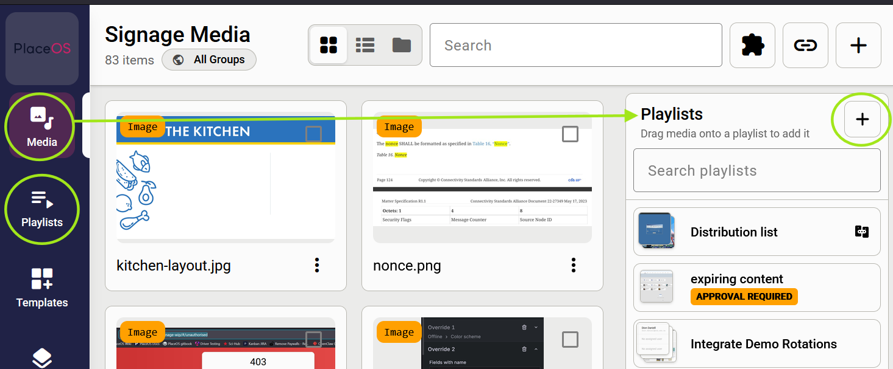
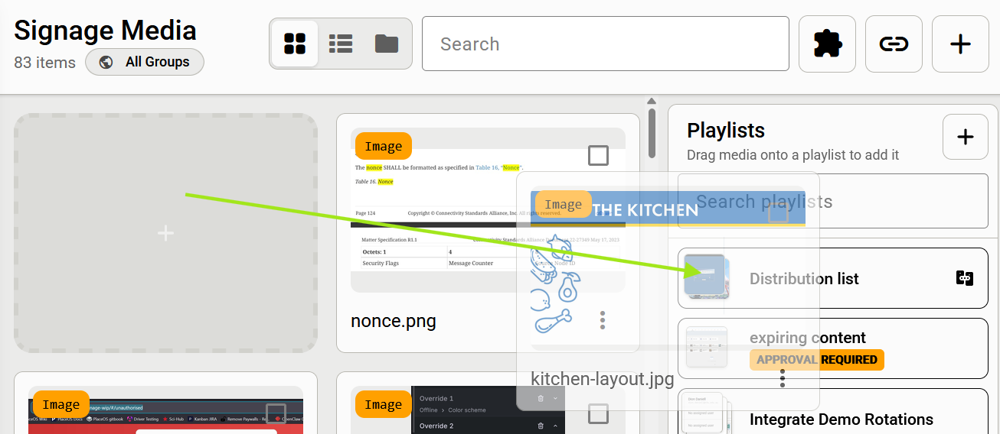
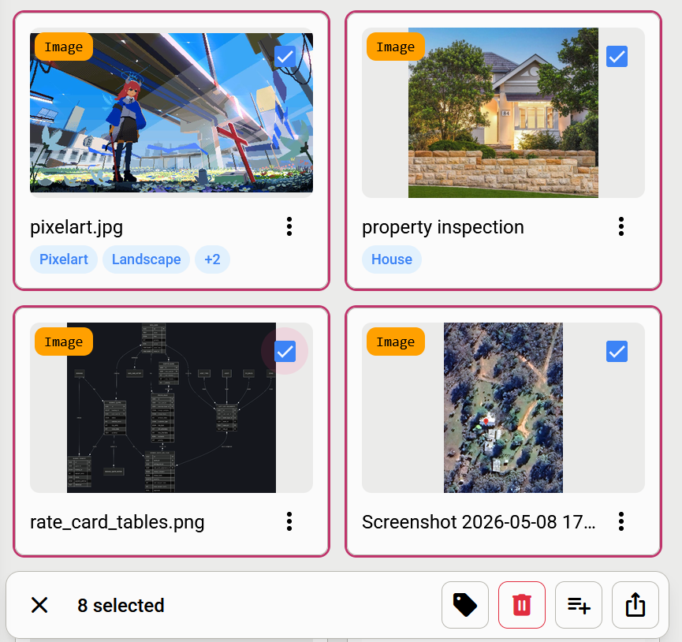

From the media tab, you can see the list of playlists and add new playlists.

When creating a playlist you can define things like:
- Playlist shuffled: randomizes the playlist items at playback time, Select this if order doesn’t matter.
- Default play time: i.e. 15 seconds. This is the default time period images are displayed before moving to the next item.
- Orientation: Landscape, portrait, square. The target orientation - when added to zones, only displays with matching orientation will pick up the playlists.
- Animation: this is the default animation between items in the playlist
- Valid from, Valid until: Dates to start presenting and stop presenting this playlist. Good for time limited promotions / campaigns.

If you prefer to seperately schedule each media item you can configure a distribution playlist.
- each media item will have its own schedule (versus the playlist having a schedule and all the content sharing that schedule)
- the playlist defines which zones or displays the media will be presented on.

## Adding Content

From the `Media` tab, click and drag the media item to the playlist:

Or you can select multiple items and use the bulk action bar:

## Editing Playlists

Selecting a playlist from the left hand column allows you to:
- Reorder items (if order matters, you may have selected shuffle)
- Edit items
  - Change playback time
  - Change animation
- Preview item playback
