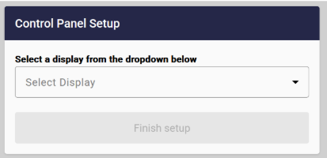

PlaceOS recommends using ChromeOS for simplified management and deployment of web based applications.
[https://www.aopen.com/US_en/products/os/chromeos](https://www.aopen.com/US_en/products/os/chromeos)

## SOE Image

It is possible to have the organizations Standard Operating Environment (SOE) imaging team create an image for a playback computer such as a NUC or compute stick
[https://www.aopen.com/NZ_en/products/embedded_pc/digital-signage-media-players](https://www.aopen.com/NZ_en/products/embedded_pc/digital-signage-media-players)
[https://store.mele.cn/pages/pc-stick-series](https://store.mele.cn/pages/pc-stick-series)

The requirements are:
1. Launch chrome or edge in kiosk mode
[https://learn.microsoft.com/en-us/deployedge/microsoft-edge-configure-kiosk-mode](https://learn.microsoft.com/en-us/deployedge/microsoft-edge-configure-kiosk-mode)
2. Launch a generic bootstrap page we provide: https://<placeos.domain.com>/signage/#/bootstrap
3. Ensure media playback is automatic:
```
msedge --kiosk https://your-url --kiosk-type=fullscreen \
  --autoplay-policy=no-user-gesture-required

chrome --kiosk https://your-url \
  --autoplay-policy=no-user-gesture-required \
  --disable-features=MediaSessionService
```

The bootstrap page allows you to rollout the hardware and select the display it represents after it has been installed. Simplifying management of the computer images and rollout.

