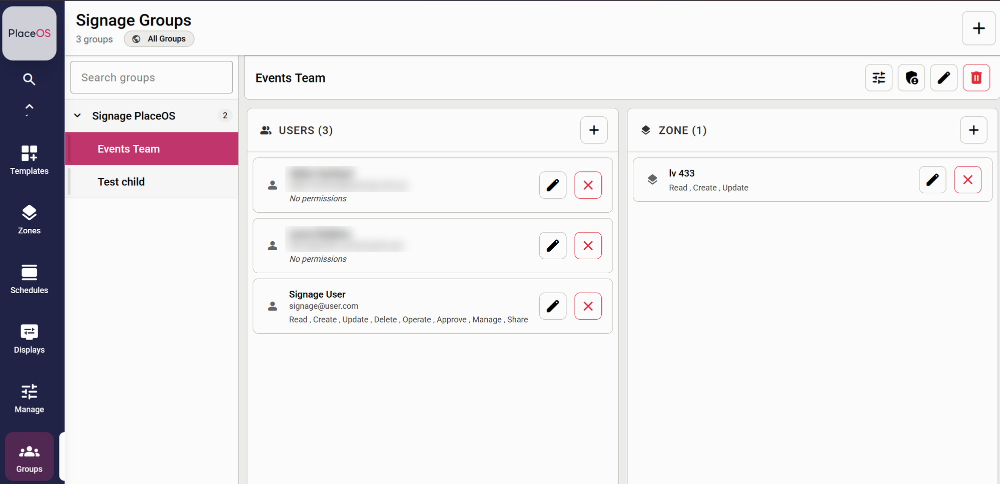
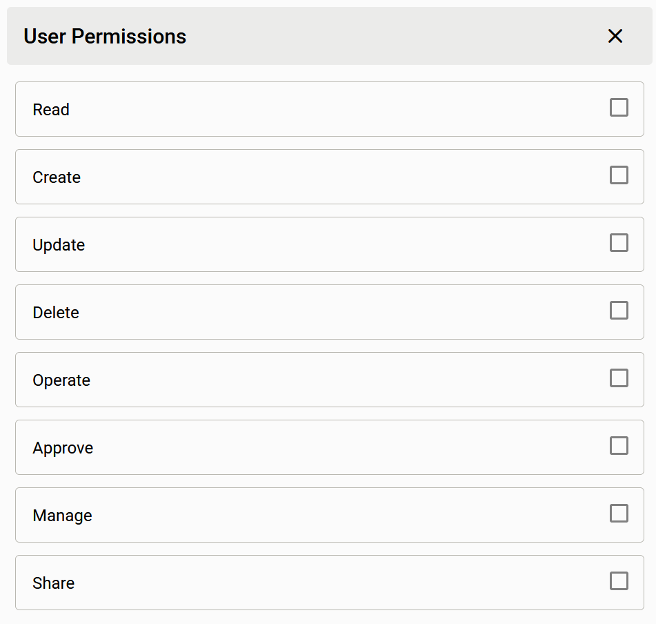

Access to Signage Manager is controlled by **signage groups**. Each group has:

- **Users**, each given a set of user permissions
- **Zones**, each given a set of zone permissions

The two work together, but they control different things:

- **User permissions** control what a person can do with the group's
  **content**: media, playlists and templates.
- **Zone permissions** control which **locations and displays** the group's
  members can work with. A member can do something to a zone or display only
  when **both** their user permission **and** the zone's permission allow it.

To change a user's permissions, select the edit button next to their name in
the group and tick the permissions they need.

## User permissions

Media, playlists and templates belong to the groups they are shared with. A
user can work with an item if they have the right permission in **any** of the
groups the item belongs to.

| Permission | What the user can do |
|---|---|
| **Read** | Browse the group's media library, including tags and thumbnails. View the group's playlists and the media in them, along with their schedules and revision history. View the group's templates and where they are applied. |
| **Create** | Upload new media to the group. Create new playlists and templates. Create artwork with AI (see [Making Artwork with AI](../07-ai-images/)). Apply a template to a zone or display. Add new displays, when the zone also allows it (see [Zone permissions](#zone-permissions)). |
| **Update** | Rename and edit media, playlists and templates. Add media to a playlist, reorder it and set when each item plays. Rename and tidy up media tags. Discard a template's draft changes. Change when an applied template plays. Assign playlists to zones and displays, when the zone also allows it. |
| **Delete** | Delete media, playlists and templates. Remove a template from a zone or display. Delete media along with a tag when removing the tag. |
| **Operate** | Not used by Signage Manager. |
| **Approve** | Approve changes to a playlist so they go live on displays. Approve a template so it can be used and shared. |
| **Manage** | Administer the group: add and remove users and zones, change their permissions, and create sub-groups. Remove items from the group and share content with other groups. Add and remove sub-zones (see [Zone permissions](#zone-permissions)). |
| **Share** | Share media, playlists and approved templates with another signage group. |

Every member of a group, whatever their permissions, can see who the group's
approvers are and **request approval** for a playlist or template.

:::note
**Manage** does not include the other permissions. A user with only Manage can
administer the group but cannot view, edit or approve its content. Give them
Read, Create, Update, Delete and Approve as well if they need to.

Users with Manage do appear in the list of approvers, so make sure anyone with
Manage also has Approve.
:::

### Deleting shared content

When an item is shared with more than one group, deleting it from within one
group only removes it from that group. Other groups keep their copy. The item
is deleted completely when it is removed from its last group.

### Sharing content

To share content with another group, the user needs **Share** (or **Manage**)
on the group receiving it, and **Read**, **Share** or **Manage** on a group
the content already belongs to. Only templates that have been approved can be
shared.

### Sub-groups

Members of a group can also work with the content of its sub-groups, using
the permissions they hold in the parent group. If they are also added to the
sub-group directly, the sub-group's permissions are used instead.

## Zone permissions

Adding a zone to a group gives the group's members access to that zone and
**every zone beneath it**. For example, adding a building gives access to all
of its levels and areas, and the displays in them.

A member can only do something to a zone or display if **both** their user
permission **and** the zone permission allow it. For example, if a user has
Update but the zone only has Read, the user cannot assign playlists to
displays in that zone.

| User has | Zone has | What the user can do |
|---|---|---|
| **Read** | **Read** | See the zone, the displays in it, and the templates applied to it |
| **Create** | **Create** | Add new displays to the zone. Every zone the new display is placed in must allow this |
| **Update** | **Update** | Assign or remove playlists on zones and displays. Edit a display's settings, such as its name and orientation. Move a display into another zone, if that zone also allows Update |
| **Manage** | **Manage** | Add sub-zones beneath the zone, and delete sub-zones that were created in Signage Manager |

:::note
Zone permissions don't control content. Applying a template to a zone or
display, changing its schedule or removing it is controlled by the user's
permissions on the **template** (Create, Update and Delete).
:::

Signage users can only work with displays. Displays can't be deleted from
Signage Manager, and zone tags can't be changed. Ask a PlaceOS administrator
if either is needed.

## Example

In the screenshot above, the **Events Team** group has the zone **lv 433**
with Read, Create and Update.

**Signage User** has every permission, so they can:

- upload, edit, approve and delete the group's media, playlists and templates
- add new displays to lv 433 and the zones beneath it
- assign playlists to those displays

They can't add sub-zones to lv 433, because the zone doesn't have Manage.

The other two members have **No permissions**. They can see who the group's
approvers are and request approval, but can't see or change any content.

## Common setups

| Role | User permissions | Zone permissions |
|---|---|---|
| Content viewer | Read | Read |
| Content creator | Read, Create, Update | Read |
| Content approver | Read, Approve | Read |
| Display coordinator | Read, Create, Update | Read, Create, Update |
| Group administrator | All except Operate | All except Operate |
