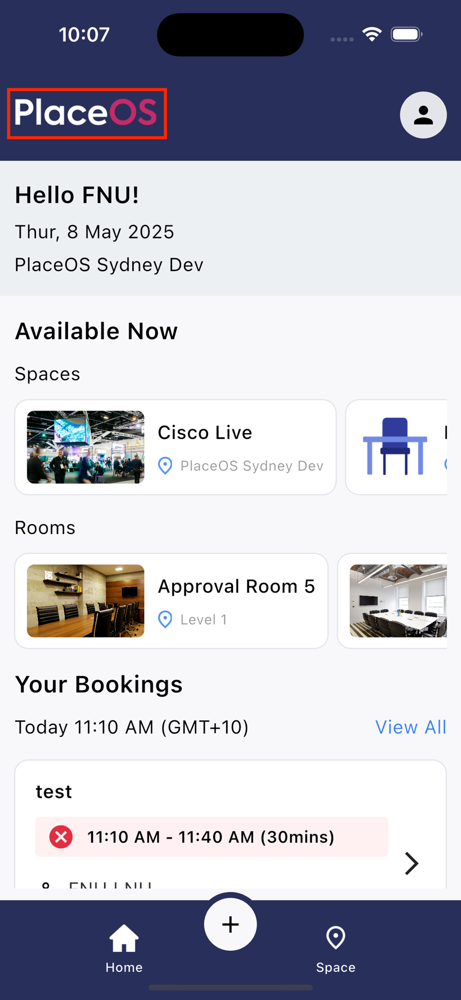
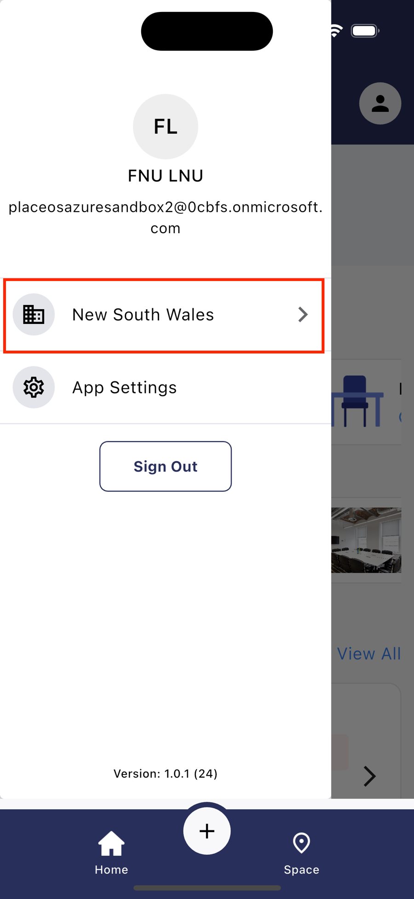
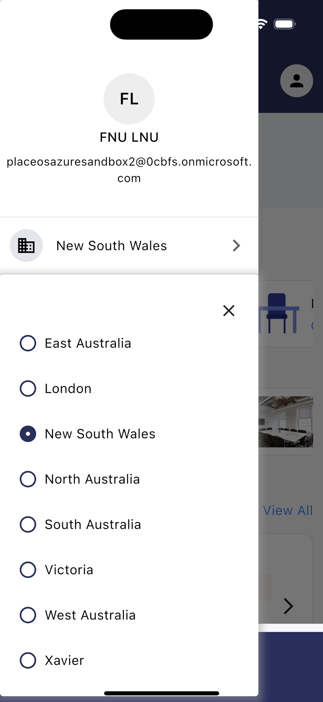

While the app can use GPS Locations associated with buildings to automatically select the closest building, you may at times need to manually switch the location.

1. Tap the PlaceOS Logo in the top left of the screen.

2. Tap the location option.

3. Select a new location from the list.

