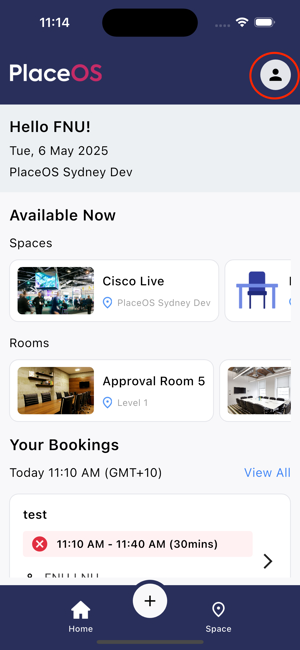
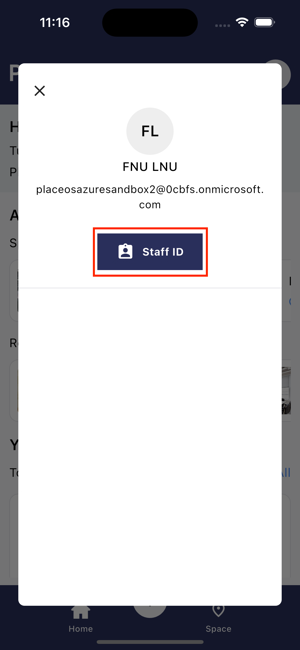
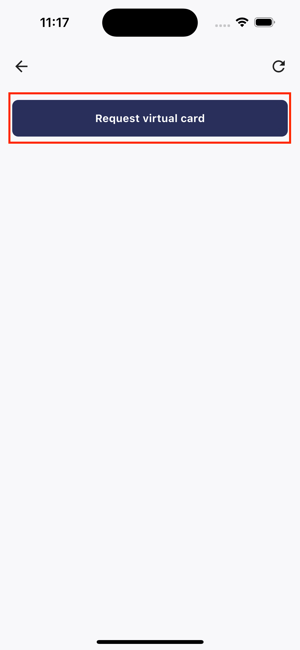
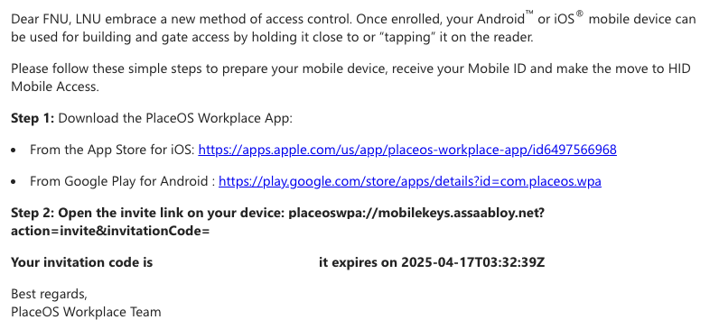
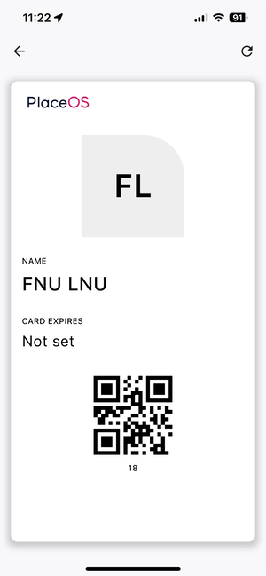

:::tip
Control hardware and access to the HID Origo Portal. Please contact our support team for more information.
:::

## Obtain Mobile ID

1. Ensure you have selected a location within the app that supports Mobile ID Access.
2. Tap the profile icon in the top right of the app.

3. Tap the Staff ID button.

4. If your site is eligible for Mobile ID, you will see the request virtual card button. Tap on the button to proceed.

5. Once requested, you will receive a notification to check your email for the invite link.

6. Check your email for the HID Origo Invite. It is best to open the link from your mobile device, as it will launch directly into the PlaceOS Workmate app and validate the invite.

7. Once validated, click on your profile image on the top right and open your Staff Card.

8. You should now see a valid staff card, showing your card number and a QR Code. The QR Code may be used for access on QR access control readers.

## Using Mobile Access ID

:::caution
Please note, Android devices do not support access control when the device is locked.
:::

Once you have a valid Mobile Access ID on your device, you can use it in-place of your physical FOB to gain access via access controlled doors.

The Mobile Access ID on the PlaceOS Workmate app will mimic the same access controls you have on your physical FOB.

You can present your Mobile Access ID in three states:

1. With the device unlocked and the PlaceOS Workmate app running, swipe your device on a HID Access reader. The reader will give an affirmative tone and change colour (depending on your hardware configuration). The device will give a vibration and optional sound notification.
2. With the device unlocked and the PlaceOS Workmate app running in the background, swipe your device on a HID Access reader.

### For iOS Devices only:

1. With the device locked (black screen), swipe your device on a HID Access reader.

:::tip
When swiping an iOS device in locked mode, the Apple Wallet app may present on the display. You can safely ignore this.
:::
