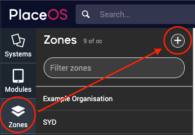
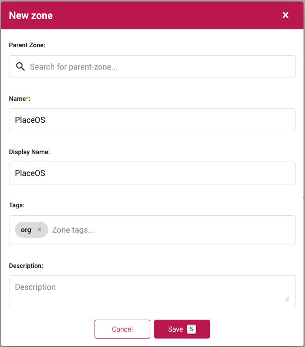
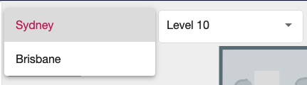
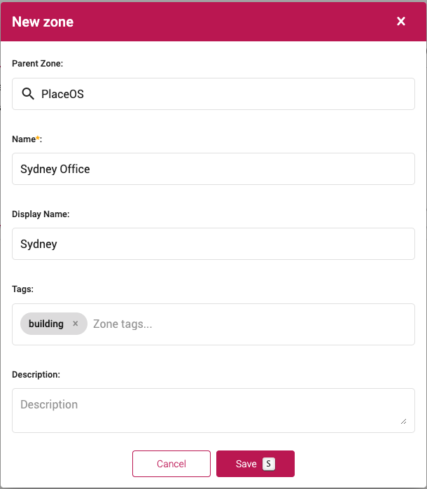
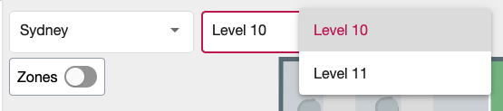
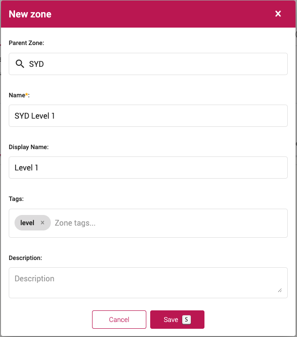
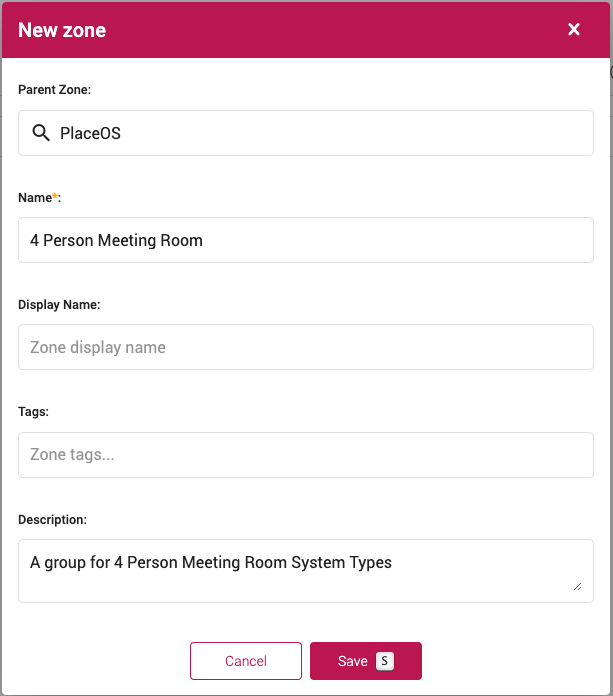

An important step in setting up PlaceOS is to create your organizations physical structure as [Zones](../../overview/zones.md).

You can think of Zones as creating your digital twin of your physical organization structure.

The three most common zones required are:
* `org` zone: your parent zone, named after your organization
* `building` zone: your buildings within your organization
* `level` zone: the levels (floors) within your buildings

In the following steps, we will walkthrough configuring your Zone structure including Organization, Building and Levels. 

## Prerequisites

* PlaceOS Backoffice Administrator Access
* [SVG Floor Plans](../../how-to/user-interfaces/svg-map-creation.md) (optional)

## Org Zone

An Org Zone is the parent zone for all other zones.

The Org Zone is typically named after the organization.

### Steps to create the org zone

1. Login to PlaceOS Backoffice
2. Navigate to Zones
3. Click the `+` button to create a new zone  
      
4. In the New Zone Modal, you will need to enter the following information:
- **Parent Zone**: Your new org zone will be the parent, leave this blank
- **Name**: The name of your org zone (typically your organization name)
- **Display Name**: How you want the zone to appear to end users (optional)
- **Tags**: Enter a single tag of `org`

The remaining fields are not required for org zones:
- **Description**: Optional zone description
- **Location**: GPS Coordinates for the building
- **Code**: Cost Center or Building Code
- **Type**: Code category
- **Capacity**: Total building capacity
- **Map**: A relevant map file 

5. Click Save

You have now created your `org` zone, this will be the parent for your `building` zones.

## Building Zones

Building Zones represent your physical buildings.

The frontend will use Building Zones to allow end users to select buildings in your organization.

### Create Building Zones

1. Login to PlaceOS Backoffice
2. Navigate to Zones
3. Click the `+` button to create a new zone  
      
4. In the New Zone Modal, you will need to enter the following information:
- **Parent Zone**: Select your Org Zone we created in the previous step as the parent
- **Name**: The name of your building zone (you could put an address or physical location)
- **Display Name**: How you want the zone to appear to end users (optional)
- **Tags**: Enter a single tag of `building`

The remaining fields are optional:
- **Description**: Optional zone description
- **Location**: GPS Coordinates for the building
- **Code**: Cost Center or Building Code
- **Type**: Code category
- **Capacity**: Primarily for defining floor/level capacity
- **Map**: A relevant map file (see [How to Upload Files to Backoffice](../../how-to/backoffice/backoffice-uploads.md))

5. Click Save

You have now created your `building` zone, this will be the parent for your `level` zones.

You will need to repeat this step to create all your buildings.

## Level Zones

Level Zones represent your buildings levels (floors).

The frontend will use Level Zones (nested in building zones) to allow end users to select levels in your buildings.

### Create Level Zones

1. Login to PlaceOS Backoffice
2. Navigate to Zones
3. Click the `+` button to create a new zone  
      
4. In the New Zone Modal, you will need to enter the following information:
- **Parent Zone**: Select your Building Zone we created in the previous step as the parent
- **Name**: The name of your Level zone (Typically this will be Level 1, Level 2 etc.)
- **Display Name**: How you want the zone to appear to end users (optional)
- **Tags**: Enter a single tag of `level`
- **Map**: A relevant map file for the level (see [How to Upload Files to Backoffice](../../how-to/backoffice/backoffice-uploads.md))

The remaining fields are optional:
- **Description**: Optional zone description
- **Location**: GPS Coordinates for the building
- **Code**: Cost Center or Building Code
- **Type**: Code category
- **Capacity**: Total level capacity

5. Click Save

You have now created your first `level` zone, this will be the parent for your system zones.

You will need to repeat this step to create all your levels.

## System Zones

System Zones group similar system types e.g. meeting rooms, video conference rooms etc.

These systems are optional.

System Zones will allow specific configuration for a group of similar systems.

### Create a System Zone

1. Login to PlaceOS Backoffice
2. Navigate to Zones
3. Click the `+` button to create a new zone  
      
4. In the New Zone Modal, you will need to enter the following information:
- **Parent Zone**: Select your Building or Org Zone we created in the previous step as the parent
- **Name**: The name of your System zone (Typically this will be 4 Person Meeting Room, MS Teams Rooms etc.)

The remaining fields are optional:
- **Display Name**: How you want the zone to appear to end users
- **Description**: Optional zone description
- **Tags**: Add tags e.g. `4-pax` or `videoconference` etc.

5. Click Save

You will now need to add systems to the zone.

<!-- TODO: Link to how to add systems tutorial -->
