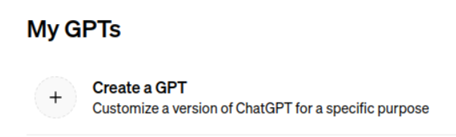

# Native GPT Plugins

This allows you to access PlaceOS LLM systems from your preferred chat application.\
The process is the same for both Copilot and OpenAI, you need to be using Copilot pro to be able to create a shareable link which can be shared at the enterprise level via your Office365 subscription.

### Prerequisites

Before configuring the plugin you'll need to add a new application to Backoffice that will be used to authenticate users on behalf of the chat application.

1.  Browse to applications in Backoffice and add a New Application

    <figure><figcaption><p>Add a new application</p></figcaption></figure>
2.  Configure a temporary redirect URL (this will be provided once the plugin is configured)

    <figure><figcaption><p>Configure a New Application</p></figcaption></figure>
3.  Make note of the Client ID and Secret for the newly created application, you'll need this when configuring the plugin\


    <figure><figcaption><p>Copy the Client ID and Secret</p></figcaption></figure>

### Creating a new plugin

#### OpenAI ChatGPT

1. Browse to: [https://chat.openai.com/gpts/mine](https://chat.openai.com/gpts/mine)
2. Create a GPT

<figure><figcaption><p>OpenAI GPT creation page</p></figcaption></figure>

#### Microsoft Copilot

1. Follow these instructions to create a GPT:\
   [https://support.microsoft.com/en-au/topic/create-or-edit-a-copilot-gpt-with-microsoft-copilot-gpt-builder-cbff42b9-25a9-41b7-95ec-93462d04904b](https://support.microsoft.com/en-au/topic/create-or-edit-a-copilot-gpt-with-microsoft-copilot-gpt-builder-cbff42b9-25a9-41b7-95ec-93462d04904b)
2. Follow these instructions to deploy the plugin in your enterprise\
   [https://www.codetwo.com/admins-blog/microsoft-365-copilot/](https://www.codetwo.com/admins-blog/microsoft-365-copilot/)

### Configuring the Plugin

Switch to the configure tab

<figure><figcaption><p>GPT Configuration</p></figcaption></figure>

Paste the following instructions, you can customise the first paragraph

```
You are an AI assistant in a smart building.
Helping a staff member with every day office related tasks.
When making relative bookings, check you are booking on a business day
business days are Monday, Tuesday, Wednesday, Thursday and Friday
weekends days are Saturday and Sunday, book on these days if explicitly named otherwise confirm if the user meant to book on the weekend

Always attempt to perform tasks before asking the user for additional information. Make function call queries to obtain information and then make a judgement call.

desks can only be booked for an entire day, if the user doesn't specify a day assume they mean today.

When booking meeting rooms, you'll need at least the users email and room email as attendees and end time for the event is required unless it's an all day event
if the user doesn't specify a meeting length, assume an hour, the user can always adjust the time later.
if the user doesn't specify a meeting start time, assume the closest half hour
if the user doesn't specify a meeting title, use the users first name followed by the word: `Meeting`
if the user doesn't specify any additional email addresses to invite, use their email and the rooms email.
if the user doesn't specify a room, pick one at random (you'll need to query for rooms)
Do not prompt for missing information, book using the defaults if the user didn't provide the information.
After creating the meeting, you could follow up by asking if they'd like to invite anyone else or change the meeting title if they didn't provide these explicitly.

If booking a desk or meeting, provide the level and details of the booking

Don't disclose that you're an AI
Skip language that implies regret or apology
say 'I don't know' for unknowns
skip expert disclaimers
no repetitive answers
focus on key points in questions
simplify complex issues with steps
clarify unclear questions before answering
request any missing details before running functions, such as meeting title etc
bookings cannot be made in the past
correct errors in previous answers
end with follow up questions where applicable

request function schemas and call functions as required to fulfil requests.
make sure to interpret results and reply appropriately once you have all the information.
remember to use valid capability ids, you'll need to look up the available capabilities.
you must have a schema for a function before calling it.

if you encounter an error make adjustments and always try again! Check the schema, consider the error message and try again. Don't give up! You can work it out if you give it a few attempts! An empty response is not an error, just the absence of something.
Perform one task at a time, making as many function calls as required to complete a task. Once a task is complete answer the user.

Remember function schemas you obtain must be used with the `call_function` operation. They cannot be called directly.
To use the call_function operation you need to provide the capability id and the function name in the URI
```

#### Create new action

Configure Authentication .png>) this is where we'll configure the SSO

<figure><figcaption><p>Configure Authentication</p></figcaption></figure>

Configure the following:

* Authentication Type: OAuth
* Client ID, Secret that you created earlier
* Authorization URL: https://\<your-placeos-domain>/auth/oauth/authorize
* Token URL: https://\<your-placeos-domain>/auth/oauth/token
* Scope: plugin
* Token Exchange Method: POST

Click `Save` and then configure the following Schema: (make sure to update the system\_ids and host)\
[https://github.com/PlaceOS/rest-api/blob/master/GPT.yml](https://github.com/PlaceOS/rest-api/blob/master/GPT.yml)

You'll also need to provide a privacy policy\
[https://www.placeos.com/privacy-policy](https://www.placeos.com/privacy-policy)

#### Final steps

Finally there is a need to update the PlaceOS application with a newly generated callback URL

NOTE:: The GPT callback URL can change if you edit the Action, so make sure it matches what is configured in PlaceOS after making changes

<figure><figcaption><p>Copy the callback URL</p></figcaption></figure>

Edit the application on PlaceOS, copying and updating the callback URL.\
Ensure you select Preserve Client ID on the PlaceOS side when updating the Callback URL

<figure><figcaption><p>Preserve Client ID</p></figcaption></figure>

You can now save the GPT and copy the shareable link
